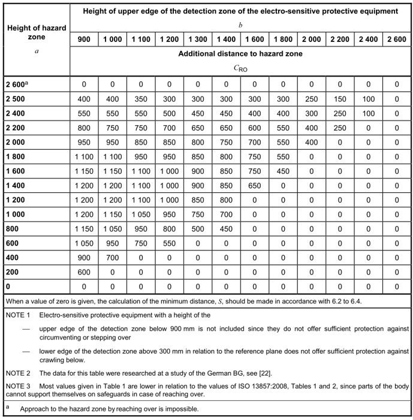

# 1.10.1. 安装安全围栏 


当机器人运行时，机器人与工人之间存在碰撞风险。因此，安装安全围栏以防止工人靠近机器人。


当机器人运行时，机器人与工人之间存在碰撞风险。因此，根据 ISO 13855:2010 安装安全围栏，以防止工人靠近机器人。 
配置系统，以确保在机器人运行期间，当工人打开安全围栏的门并接近设备时，无论出于何种原因，例如检查机器人或焊接夹具、进行刀具磨尖或更换刀具等，机器人都会停止。 

 
图 1.4 安全围栏的连接 

来源：ISO 13855:2010 机械安全 - 关于人体部位接近速度的安全防护装置的定位
 
表 1-3 安全围栏的安装标准
 

来源：ISO 13855:2010 机械安全 - 关于人体部位接近速度的安全防护装置的定位

* 安全围栏应覆盖机器人的操作区域，并应确保足够的空间，以便工人在进行教学、维护等工作时不会干扰。
安全围栏应制作坚固，以防止其轻易被移动，并应结构设计成不允许人们越过安全围栏进入围栏内。
* 原则上，要求安装和使用没有不平或锋利部件的固定类型安全围栏。
* 应安装入口门，以允许人员进入安全围栏，并且在门上必须安装安全插头，以确保门在未拆除插头时不会打开。 
此外，布线应配置为在安全插头被拆除或安全围栏被打开时，使电机关闭且制动处于保持状态。
* 如果想在安全插头拆除时仍操作机器人，则应配置布线使机器人以低速回放运行。
* 将机器人的紧急停止按钮安装在操作员可以快速按压的位置。
* 如果不安装安全围栏，则应安装光电开关和垫开关等安全装置，覆盖在安全防护范围内机器人的整个区域，作为安全围栏的替代设备，使机器人在有人进入安全围栏时能自动停机。
* 确保机器人的操作区域（危险区）可以通过某种方式识别，例如在地面上涂漆。