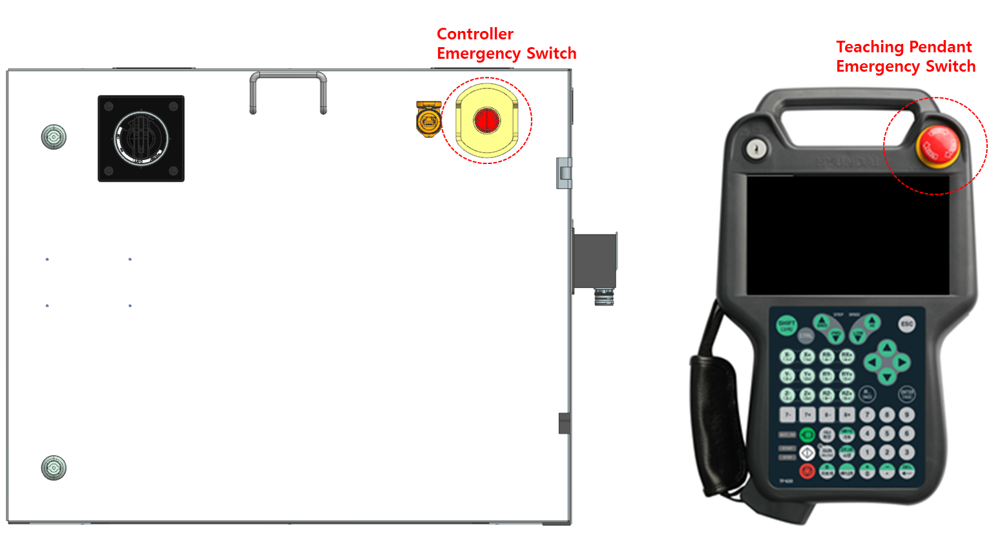
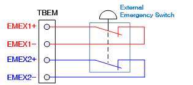

# 1.8.1. 主要安全功能  

* 紧急停止 (IEC 60204-1,10,7) 
控制器和教学挂件上各有一个紧急停止按钮。如有必要，可以将额外的紧急按钮连接到机器人的安全链电路中。 
紧急停止功能的优先级高于机器人的所有其他控制功能。该功能会立即切断机器人各个轴电机的电源，停止机器人并使机器人控制的安全相关功能无法使用。  


由于紧急停止功能会立即切断电机电源，因此随意使用该功能可能会导致疲劳积累，从而影响机器人的耐用性。该功能仅能在紧急情况下使用。 


 
图 1.2 控制器和教学挂件上的紧急停止按钮

 
图 1.3 附加紧急停止装置的连接 

* 保护停止 (ISO 10218-1:2011) 
机器人应具有多个安全输入，以便与外部安全设备如安全护栏、安全垫和安全灯一起使用。当机器人自身和外围设备发出输入时，这些安全输入将使机器人停止，确保安全状态。 
有关连接安全输入的详细信息，请参阅 "4.3.2. 安全模块 (BD642)"。 

* 速度限制 (EN ISO 10218-1:2011) 
在手动操作模式下，机器人的速度限制为最大 250 mm/s。速度限制不仅适用于 TCP（工具中心点），还适用于所有在手动模式下操作的机器人其他部分。还应能够监测安装在机器人上的设备的速度。 

* 操作区域限制 (ANSI/RIA R15.06-2012) 
在应用机器人时，为确保足够的安全区域，可以通过使用硬件限制或挡块来限制机器人的操作范围。此功能可以在机器人与外部安全设备如安全护栏发生碰撞时，最小化损害。轴 1、2 和 3 主要通过挡块或硬件限制来限制。如果由于机械挡块或硬件限制而改变操作范围，则应在软件中更改操作范围限制参数。有关更改，请参阅操作手册。 
每个轴的操作区域限制可以由用户更改，发货时设置为机器人的最大操作范围。Hi7 控制器的安全系统可选择支持最多 4 个硬件限位开关。有关连接事宜，请参阅 "4.3.2. 安全模块 (BD642)"。

* 操作模式选择 (ANSI/RIA R15.06-2012)

您可以在手动、自动或远程模式下操作机器人。手动模式下的最大速度限制为 250 mm/s，您只能使用教学挂件进行操作。此外，可以通过将模式开关配置为选项，额外安装在控制面板上。 
有关操作的详细信息，请参阅操作手册。