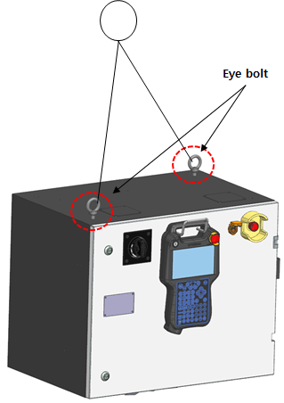
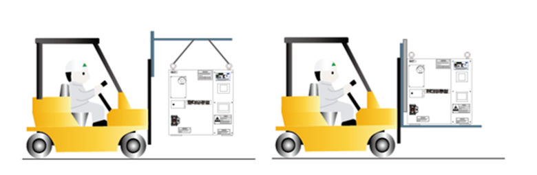

# 3.3.2. 运输（修改重量）

* 检查控制器的前门是否完全锁定。
* 移除控制器上未固定的任何物品。
* 检查控制器上的眼螺栓是否牢固固定。
* 由于控制器是精密设备，注意运输时防止其受到强烈冲击。
* 控制器的重量最大为170kg。使用起重机时，采取预防措施以防止控制器上的物体被电缆损坏。
* 关于控制器的重量，请参考“2. 详细配置”。
* 使用叉车时，以防控制器晃动的方式固定控制器。
* 通过车辆移动产品时，使用水母固定操作器和控制器。
* 运输产品时，充分了解与包装和运输相关的内容，并遵循说明。由于客户的疏忽、操作经验不足或疏忽造成的产品损坏或破损，我公司不承担任何责任。
* 使用起重机运输控制器时，请检查以下事项。
  - 一般来说，控制器应使用眼螺栓所用的起重机电缆进行运输。
  - 检查电缆是否具有足够的强度以承受控制器的重量。
  - 检查眼螺栓是否紧固。

 
图 3.3 控制器电缆连接位置 

* 使用叉车运输控制器时，请检查以下事项，
  - 使用电缆绳运输产品时，请使用可以承受控制器重量的电缆。
  - 检查眼螺栓是否牢固固定。
  - 运输控制器时尽量保持其尽可能低的位置。

 
图 3.4 使用叉车运输控制器 


如果使用提升设备运输产品，应遵守相关国家和地方安全法规及设备使用指南。使用起重机移动产品时，必须确保没有工人在产品下方。同时，切勿在起重机或产品下方工作或走动。
