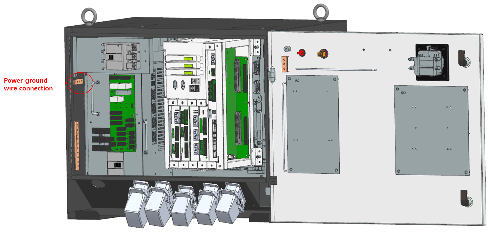

# 3.6.4. The Controller and Grounding

For using the controller safely, connect the grounding wire to the controller. Use a grounding wire of 5.5 ㎟ or more.(Grounding of Category 3). 
The ground terminal location of the controller is shown in Figure 3.9. 

 
Figure 3.9 Power Ground Terminal of the Controller 