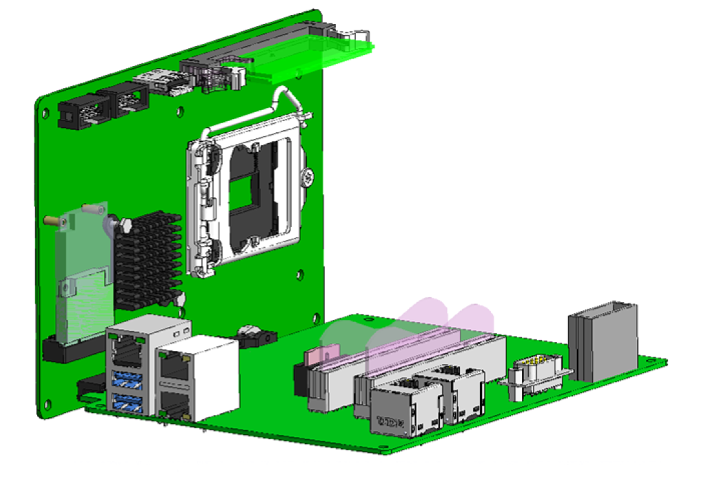

# 4.3.1.1. 概述

H6COM-T 的结构如图 4.9 所示，其中主 CPU 板和载板相结合。主 CPU 板包括一个 SSD 插槽、一个 CPU 插槽、一个存储卡插槽、一个 USB 端口、一个 COM 端口以及一个用于连接到载板的总线连接器。载板包含三个 
LAN 端口用于外部系统，两个 LAN 端口用于内部系统，两个 USB 端口，一个 GPIO 端口，两个 PCI 连接器，一个 PCI-e 连接器和一个 DC 24V 电源连接器。内部系统的 LAN 端口用于 EtherCAT 通信，以及与教导挂件接口，GPIO 端口用于检测电源系统的电源故障信号。SB 用于调试。提供一个 PCI 扩展槽和三个备用的 LAN 端口用于外部系统，以支持其他通用总线接口。连接到除 EtherCAT 之外的其他通信接口可以通过相关插槽进行。

 
图 4.8 H6COM-T 