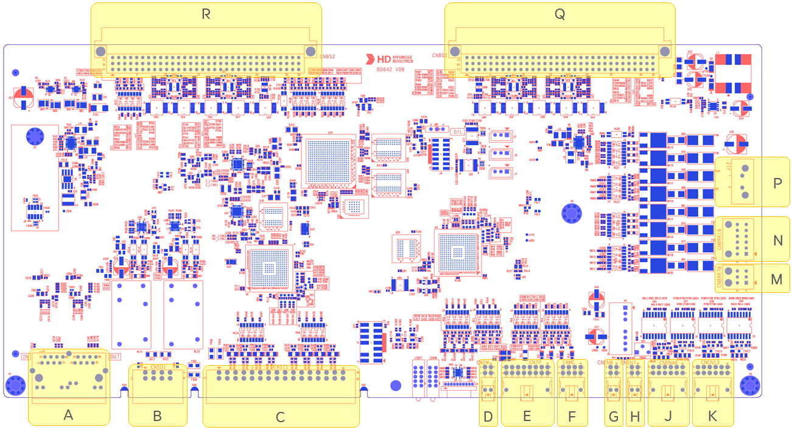

# 4.3.2.2. 커넥터

아래 그림은 서보/안전모듈(BD642)의 외부연결에 필요한 커넥터의 위치를 보여줍니다. 또한, 아래 표는 각 커넥터의 명칭, 용도를 기술합니다.   

그림 4.3.2.2-1 서보/안전모듈(BD642)커넥터 배치

표 4.3.2.2-1 서보/안전모듈(BD642)커넥터 명칭, 용도 및 외부연결장치
<table>
<thead>
  <tr>
    <th><strong>번호</strong></th>
    <th><strong>명칭</strong></th>
    <th><strong>용도</strong></th>
    <th><strong>외부연결장치</strong></th>
  </tr>
</thead>
<tbody>
  <tr>
    <td>A</td>
    <td>J4</td>
    <td>EtherCAT 통신연결</td>
    <td>Hi6COM LAN4</td>
  </tr>
  <tr>
    <td>B</td>
    <td>CNSO1</td>
    <td>안전 출력단자</td>
    <td>외부 디바이스</td>
  </tr>
  <tr>
    <td>C</td>
    <td>CNSI1</td>
    <td>안전 입력단자</td>
    <td>외부 디바이스</td>
  </tr>
  <tr>
    <td>D</td>
    <td>CNEM</td>
    <td>외부 비상 스위치</td>
    <td>비상 스위치</td>
  </tr>
  <tr>
    <td>E</td>
    <td>CNTP</td>
    <td>티칭펜던트(전원,비상정지,모드스위치,인에이블 스위치)</td>
    <td>커넥터 CNRTP</td>
  </tr>
  <tr>
    <td>F</td>
    <td>CNMC</td>
    <td>Magnet Contact 입/출력 신호</td>
    <td>전원분배보드(BD6C2) CNMC</td>
  </tr>
  <tr>
    <td>G</td>
    <td>CNEN8</td>
    <td>부가축 8축 엔코더 신호</td>
    <td>커넥터 AEC2</td>
  </tr>
  <tr>
    <td>H</td>
    <td>CNEN7</td>
    <td>부가축 7축 엔코더 신호</td>
    <td>커넥터 AEC1</td>
  </tr>
  <tr>
    <td>J</td>
    <td>CNEN46</td>
    <td>4~6축 엔코더 신호</td>
    <td>커넥터 CEC1</td>
  </tr>
  <tr>
    <td>K</td>
    <td>CNEN13</td>
    <td>1~3축 엔코더 신호</td>
    <td>커넥터 CEC1</td>
  </tr>
  <tr>
    <td>M</td>
    <td>CNBRK78</td>
    <td>부가축 7,8축 브레이크 신호</td>
    <td>커넥터 AMC1, AMC2</td>
  </tr>
  <tr>
    <td>N</td>
    <td>CNBRK16</td>
    <td>1~6축 브레이크 신호</td>
    <td>커넥터 CMC1, CMC2</td>
  </tr>
  <tr>
    <td>P</td>
    <td>J12</td>
    <td>브레이크 전원</td>
    <td>전원분배보드(BD6C2) CNOBK</td>
  </tr>
  <tr>
    <td>Q</td>
    <td>CNBS1</td>
    <td>구동장치 인터페이스 신호</td>
    <td>백플레인보드(BD604) CNBS1</td>
  </tr>
  <tr>
    <td>R</td>
    <td>CNBS2</td>
    <td>구동장치 인터페이스 신호</td>
    <td>백플레인보드(BD604) CNBS2</td>
  </tr>
</tbody>
</table>
      

안전관련 입력을 연결하여 활성화를 한경우 반드시 “1.11. 로봇 조작시 안전대책”을 참고하여 기능 정상 동작 여부를 확인하여 주십시오.

