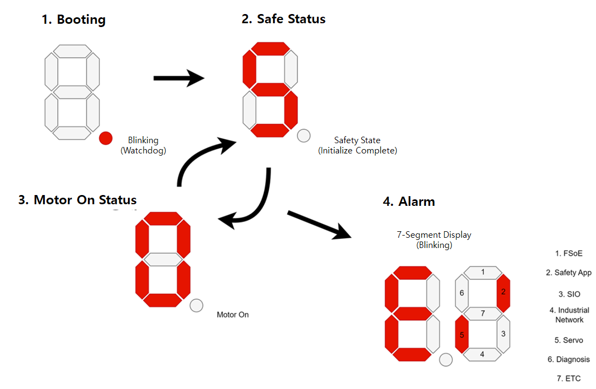

# 4.3.2.3. 指示灯

(1) 板顶指示灯

下图显示了伺服/安全模块(BD642)顶面指示灯(LED和7段显示器)的位置。
下表描述了每个指示灯的功能。

   
图 4.3.2.3-1 伺服/安全模块(BD642)的板顶指示灯布局

表 4.3.2.3-1 伺服/安全模块(BD642)的板顶指示灯描述   
<table>
<thead>
  <tr>
    <th><strong>编号</strong></th>
    <th><strong>指示灯</strong></th>
    <th><strong>描述</strong></th>
    <th><strong>颜色</strong></th>
    <th><strong>正常状态</strong></th>
    <th><strong>异常情况下的行动</strong></th>
  </tr>
</thead>
<tbody>
  <tr>
    <td>(1) (2)</td>
    <td>LED1 LED2</td>
    <td>输入电源限制功能</td>
    <td>红色</td>
    <td>熄灭</td>
    <td>
      症状: 红色LED亮起
       原因: 输入电压过低或过高
       行动: 检查输入电压(24 V)
    </td>
  </tr>
  <tr>
    <td>(3)</td>
    <td>LED3</td>
    <td>外部A通道电源</td>
    <td>黄色</td>
    <td>亮起</td>
    <td>
      症状: 黄色LED熄灭
       原因: 外部A通道电源过流或外部接线错误
       行动: 检查熔断器(FS2)
    </td>
  </tr>
  <tr>
    <td>(4)</td>
    <td>LED4</td>
    <td>外部B通道电源</td>
    <td>黄色</td>
    <td>亮起</td>
    <td>
      症状: 黄色LED熄灭
       原因: 外部B通道电源过流或外部接线错误
       行动: 检查熔断器(FS3)
    </td>
  </tr>
  <tr>
    <td>(5)</td>
    <td>LED5</td>
    <td>A通道MCU电源</td>
    <td>黄色</td>
    <td>亮起</td>
    <td>
      症状: 黄色LED熄灭
       原因: A通道MCU电源异常(3.3V, 1.2V)
       行动: 更换板(BD642)
    </td>
  </tr>
  <tr>
    <td>(6)</td>
    <td>LED6</td>
    <td>B通道MCU电源</td>
    <td>黄色</td>
    <td>亮起</td>
    <td>
      症状: 黄色LED熄灭
       原因: B通道MCU电源异常(3.3V, 1.2V)
       行动: 更换板(BD642)
    </td>
  </tr>
  <tr>
    <td>(7)</td>
    <td>LED7</td>
    <td>A通道MCU状态指示灯</td>
    <td>红色
       绿色
       蓝色
    </td>
    <td>RGB闪烁</td>
    <td>
      症状: 所有LED熄灭且无闪烁
       原因 1: A通道MCU电源异常(3.3V, 1.2V)
       原因 2: A通道MCU程序故障
       行动: 更换板(BD642)
    </td>
  </tr>
  <tr>
    <td>(8)</td>
    <td>LED8</td>
    <td>B通道MCU状态指示灯</td>
    <td>红色
       绿色
       蓝色
    </td>
    <td>RGB闪烁</td>
    <td>
      症状: 所有LED熄灭且无闪烁
       原因 1: B通道MCU电源异常(3.3V, 1.2V)
       原因 2: B通道MCU程序故障
       行动: 更换板(BD642)
    </td>
  </tr>
  <tr>
    <td>(9)
       (10)</td>
    <td>LED9
       LED10</td>
    <td>A通道MCU EtherCAT LINK0状态
       A通道MCU EtherCAT LINK1状态
    </td>
    <td>绿色
       绿色
    </td>
    <td>绿色闪烁
       绿色闪烁
    </td>
    <td>
      症状: 无闪烁
       原因: A通道MCU EtherCAT故障
       行动: 更换板(BD642)
    </td>
  </tr>
  <tr>
    <td>(11)
       (12)</td>
    <td>LED13
       LED14</td>
    <td>FPGA EtherCAT LINK0状态
       FPGA EtherCAT LINK1状态
    </td>
    <td>绿色
       绿色
    </td>
    <td>绿色闪烁
       绿色闪烁
    </td>
    <td>
      症状: 无闪烁
       原因: FPGA EtherCAT故障
       行动: 更换板(BD642)
    </td>
  </tr>
  <tr>
    <td>(13)</td>
    <td>LED17</td>
    <td>FPGA电源状态</td>
    <td>黄色</td>
    <td>亮起</td>
    <td>
      症状: 黄色LED熄灭
       原因: FPGA电源异常(5V, 3.3V, 1.8V, 1.35V, 1V)
       行动: 更换板(BD642)
    </td>
  </tr>
  <tr>
    <td>(14)</td>
    <td>LED18</td>
    <td>FPGA状态指示灯</td>
    <td>红色
       绿色
       蓝色</td>
    <td>RGB闪烁</td>
    <td>
      症状: 所有LED熄灭且无闪烁
       原因 1: FPGA电源异常 (5V, 3.3V, 1.8V, 1.35 V, 1V)
       原因 2: FPGA程序故障
       行动: 更换板(BD642)
    </td>
  </tr>
  <tr>
    <td>(15)</td>
    <td>LED19
       LED21
       LED23
       LED25
       LED20
       LED22
       LED24
       LED26
      </td>
    <td>  轴1制动状态
       轴2制动状态
       轴3制动状态
       轴4制动状态
       轴5制动状态
       轴6制动状态
       轴7制动状态
       轴8制动状态
      </td>
    <td>橙色</td>
    <td>制动释放(亮起)
       制动保持 (熄灭)
    </td>
    <td>
      症状: 制动状态不匹配
       原因 1: 制动电源异常
       原因 2: 线束故障或接线问题
       行动: 更换板(BD642)
    </td>
  </tr>

  <tr>
    <td>(16) 
        (17) 
        (18)
    </td>
    <td>LED27
       LED28
       SEG1
    </td>
    <td>  
    </td>
    <td></td>
    <td></td>
    <td>
      请参阅以下部分: 前面板指示灯
    </td>
  </tr>

</table>
</tbody>

(2) 前面板指示灯
下图显示了伺服/安全模块(BD642)的前面板指示灯。下表描述了每个指示灯的功能。

   
图 4.3.2.3-2 伺服/安全模块(BD642)的前面板指示灯布局

表 4.3.2.3-2 伺服/安全模块(BD642)的前面板指示灯描述
<table>
<thead>
  <tr>
    <th><strong>编号</strong></th>
    <th><strong>指示灯</strong></th>
    <th><strong>描述</strong></th>
    <th><strong>颜色</strong></th>
    <th><strong>状态</strong></th>
    <th><strong>状态描述</strong></th>
  </tr>
</thead>
<tbody>
  <tr>
    <td rowspan="2">(1)</td>
    <td>A_SO1</td>
    <td>A通道安全输出1状态指示灯</td>
    <td rowspan="2">绿色 </td>
    <td rowspan="2">亮起 熄灭</td>
    <td rowspan="2">A通道安全输出1亮起状态 
                    A通道安全输出1熄灭状态</td>
  </tr>
  <tr>
    <td>B_SO1</td>
    <td>B通道安全输出1亮起状态</td>
  </tr>
  <tr>
    <td rowspan="2">(2)</td>
    <td>A_SIx 
        (x=1~4)</td>
    <td>A通道安全输入x状态指示灯</td>
    <td rowspan="2">绿色</td>
    <td rowspan="2">亮起 熄灭</td>
    <td rowspan="2">A通道安全输入x亮起状态 
                    A通道安全输入x熄灭状态</td>
  </tr>
  <tr>
    <td>B_SIn 
        (n=1~4)</td>
    <td>B通道安全输入n状态指示灯</td>
  </tr>

  <tr>
    <td rowspan="10">(3)</td>
    <td>LED27 (1)</td>
    <td>LED27 (1)指示灯</td>
    <td rowspan="5">绿色</td>
    <td>
    <td> LED27 (1) MCU_A MOD</td>
  </tr>
  <tr>
    <td>LED27 (2)</td>
    <td>LED27 (2)指示灯</td>
    <td>
    <td>LED27 (2) MCU_B MOD</td>
  </tr>
  <tr>
    <td>LED27 (3)</td>
    <td>LED27 (3)指示灯</td>
    <td>
    <td>LED27 (3) ZYNQ MOD</td>
  </tr>
  <tr>
    <td>LED27 (4)</td>
    <td>LED27 (4)指示灯</td>
    <td>
    <td>LED27 (4) DSP_RUN</td>
  </tr>
  <tr>
    <td>LED27 (5)</td>
    <td>LED27 (5)指示灯</td>
    <td>
    <td>LED27 (5) ZYNQ_RUN</td>
  </tr>
  <tr>
    <td>LED28 (1)</td>
    <td>LED28 (1)指示灯</td>
    <td rowspan="5">红色</td>
    <td>
    <td>LED28 (1) MCU_A STA</td>
  </tr>
  <tr>
    <td>LED28 (2)</td>
    <td>LED28 (2)指示灯</td>
    <td>
    <td>LED28 (2) MCU_B STA</td>
  </tr>
  <tr>
    <td>LED28 (3)</td>
    <td>LED28 (3)指示灯</td>
    <td>
    <td>LED28 (3) ZYNQ STA</td>
  </tr>
  <tr>
    <td>LED28 (4)</td>
    <td>LED28 (4)指示灯</td>
    <td>
    <td>LED28 (4) DSP ERR</td>
  </tr>
  <tr>
    <td>LED28 (5)</td>
    <td>LED28 (5)指示灯</td>
    <td>
    <td>LED28 (5) ZYNQ ERR</td>
  </tr>
  <tr>
    <td>(4)</td>
    <td>SEG1</td>
    <td>BD642板状态指示灯</td>
    <td rowspan="2">红色 </td>
    <td>             </td>
    <td>显示启动状态</td>
  </tr>
</table>

表 4.3.2.3-3 前LED状态描述(BD642)
  

  
图 4.3.2.3-3 段状态指示