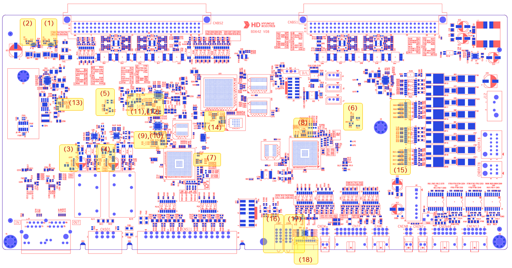
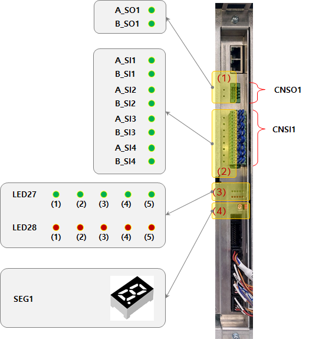
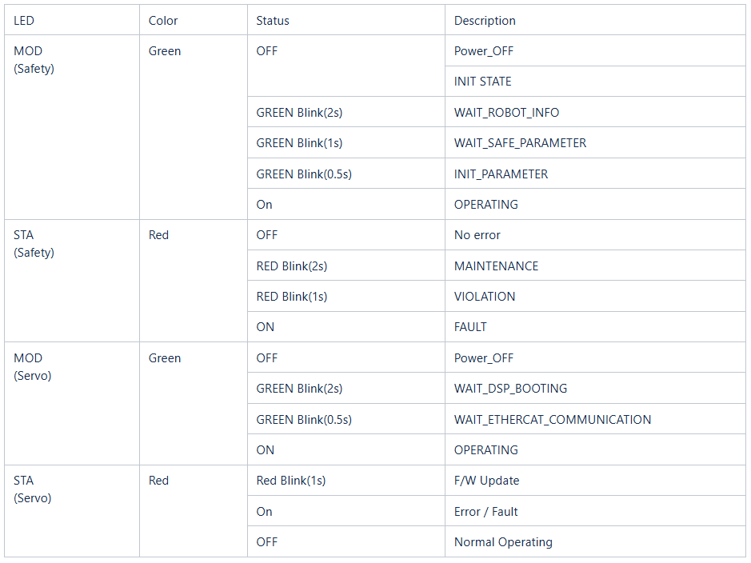
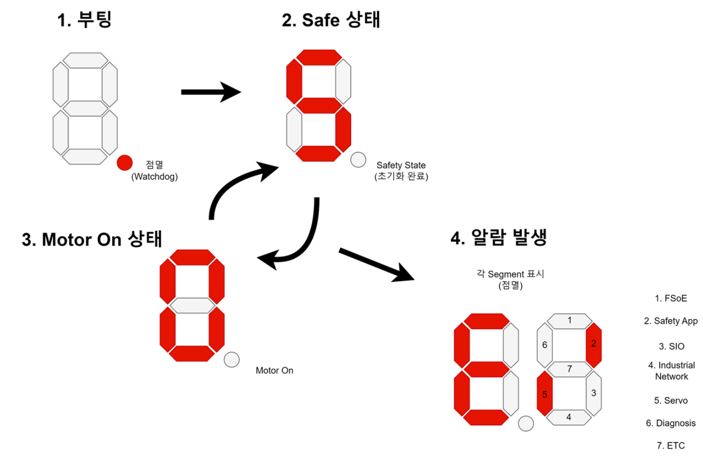

# 4.3.2.3. 표시장치

(1) 보드 TOP면 표시 장치   

아래 그림은 서보/안전모듈(BD642)의 표시장치(LED, 7세그먼트) 위치를 보여줍니다. 아래 표는 각 표시의 내용을 기술합니다.   

   
그림 4.3.2.3-1 서보/안전모듈(BD642) 보드TOP 표시장치 배치

표 4.3.2.3-1 서보/안전모듈(BD642) 보드TOP 표시장치 설명   
<table>
<thead>
  <tr>
    <th><strong>번호</strong></th>
    <th><strong>명칭</strong></th>
    <th><strong>표시내용</strong></th>
    <th><strong>색상</strong></th>
    <th><strong>정상시</strong></th>
    <th><strong>이상시 조치내용</strong></th>
  </tr>
</thead>
<tbody>
  <tr>
    <td>(1) (2)</td>
    <td>LED1 LED2</td>
    <td>입력전원 제한기능</td>
    <td>적색</td>
    <td>소등</td>
    <td>
      현상 : 적색 점등
       원인 : 입력전압 저전압 또는 과전압 발생
       조치 : 입력전압(24V) 확인
    </td>
  </tr>
  <tr>
    <td>(3)</td>
    <td>LED3</td>
    <td>외부 A채널 전원</td>
    <td>노란색</td>
    <td>점등</td>
    <td>
      현상: 노란색 소등
       원인 : 외부 A채널 전원 과전류 및 외부결선 오작업 등
       조치 : 퓨즈(FS2) 확인
    </td>
  </tr>
  <tr>
    <td>(4)</td>
    <td>LED4</td>
    <td>외부 B채널 전원</td>
    <td>노란색</td>
    <td>점등</td>
    <td>
      현상: 노란색 소등
       원인 : 외부 B채널 전원 과전류 및 외부결선 오작업 등
       조치 : 퓨즈(FS3) 확인
    </td>
  </tr>
  <tr>
    <td>(5)</td>
    <td>LED5</td>
    <td>A채널 MCU 전원</td>
    <td>노란색</td>
    <td>점등</td>
    <td>
      현상 : 노란색 소등
       원인 : A채널 MCU 전원(3.3V, 1.2V) 이상
       조치 : 보드(BD642) 교체
    </td>
  </tr>
  <tr>
    <td>(6)</td>
    <td>LED6</td>
    <td>B채널 MCU 전원</td>
    <td>노란색</td>
    <td>점등</td>
    <td>
      현상 : 노란색 소등
       원인 : B채널 MCU 전원(3.3V, 1.2V) 이상
       조치 : 보드(BD642) 교체
    </td>
  </tr>
  <tr>
    <td>(7)</td>
    <td>LED7</td>
    <td>A채널 MCU 상태 표시</td>
    <td>적색
       녹색
       파란색
    </td>
    <td>RGB 깜박임</td>
    <td>
      현상 : 전체 소등 및 깜박임 없음
       원인1 : A채널 MCU 전원(3.3V, 1.2V) 이상
       원인2 : A채널 MCU 프로그램 이상 등
       조치 : 보드(BD642) 교체
    </td>
  </tr>
  <tr>
    <td>(8)</td>
    <td>LED8</td>
    <td>B채널 MCU 상태 표시</td>
    <td>적색
       녹색
       파란색
    </td>
    <td>RGB 깜박임</td>
    <td>
      현상 : 전체 소등 및 깜박임 없음
       원인1 : B채널 MCU 전원(3.3V, 1.2V) 이상
       원인2 : B채널 MCU 프로그램 이상 등
       조치 : 보드(BD642) 교체
    </td>
  </tr>
  <tr>
    <td>(9)
       (10)</td>
    <td>LED9
       LED10</td>
    <td>A채널 MCU EtherCAT LINK0 상태
       A채널 MCU EtherCAT LINK1 상태
    </td>
    <td>녹색
       녹색
    </td>
    <td>녹색 깜박임
       녹색 깜박임
    </td>
    <td>
      현상 : 깜박임 없음
       원인 : A채널 MCU EtherCAT 이상
       조치 : 보드(BD642) 교체
    </td>
  </tr>
  <tr>
    <td>(11)
       (12)</td>
    <td>LED13
       LED14</td>
    <td>FPGA EtherCAT LINK0 상태
       FPGA EtherCAT LINK1 상태
    </td>
    <td>녹색
       녹색
    </td>
    <td>녹색 깜박임
       녹색 깜박임
    </td>
    <td>
      현상 : 깜박임 없음
       원인 : FPGA EtherCAT 이상
       조치 : 보드(BD642) 교체
    </td>
  </tr>
  <tr>
    <td>(13)</td>
    <td>LED17</td>
    <td>FPGA 전원 상태</td>
    <td>노란색</td>
    <td>점등</td>
    <td>
      현상 : 노락색 소등
       원인 : FPGA 전원(5V,3.3V,1.8V,1.35V,1V) 이상
       조치 : 보드(BD642) 교체
    </td>
  </tr>
  <tr>
    <td>(14)</td>
    <td>LED18</td>
    <td>FPGA 상태 표시</td>
    <td>적색
       녹색
       파란색</td>
    <td>RGB 깜박임</td>
    <td>
      현상 : 전체 소등 및 깜박임 없음
       원인1 : FPGA 전원(5V,3.3V,1.8V,1.35V,1V) 이상
       원인2 : FPGA 프로그램 이상 등
       조치 : 보드(BD642) 교체
    </td>
  </tr>
  <tr>
    <td>(15)</td>
    <td>LED19
       LED21
       LED23
       LED25
       LED20
       LED22
       LED24
       LED26
      </td>
    <td>  1축 브레이크 상태
       2축 브레이크 상태
       3축 브레이크 상태
       4축 브레이크 상태
       5축 브레이크 상태
       6축 브레이크 상태
       7축 브레이크 상태
       8축 브레이크 상태
      </td>
    <td>주황식</td>
    <td>브레이크 릴리스(점등)
       브레이크 홀드(소등)
    </td>
    <td>
      현상 : 브레이크 상태 불일치
       원인1 : 브레이크 전원 이상
       원인2 : 하네스 불량 등
       조치 : 보드(BD642) 교체
    </td>
  </tr>

  <tr>
    <td>(16) 
        (17) 
        (18)
    </td>
    <td>LED27
       LED28
       SEG1
    </td>
    <td>  
    </td>
    <td></td>
    <td></td>
    <td>
      다음 전면표시 장치 항목 참조
    </td>
  </tr>

</table>
</tbody>

(2) 보드 전면 표시 장치   
아래 그림은 서보/안전모듈(BD642)의 전면 표시 장치를 보여줍니다. 아래 표는 각 표시의 내용을 기술합니다.

   
그림 4.3.2.3-2 서보/안전모듈(BD642) 전면 표시장치 배치

표 4.3.2.3-2 서보/안전모듈(BD642) 전면 표시장치 설명   
<table>
<thead>
  <tr>
    <th><strong>번호</strong></th>
    <th><strong>명칭</strong></th>
    <th><strong>표시내용</strong></th>
    <th><strong>색상</strong></th>
    <th><strong>표시상태</strong></th>
    <th><strong>표시상태 설명</strong></th>
  </tr>
</thead>
<tbody>
  <tr>
    <td rowspan="2">(1)</td>
    <td>A_SO1</td>
    <td>A채널 안전출력1 상태표시</td>
    <td rowspan="2">녹색 </td>
    <td rowspan="2">점등 소등</td>
    <td rowspan="2">각 채널 안전출력1 ON 상태  
                    각 채널 안전출력1 OFF 상태</td>
  </tr>
  <tr>
    <td>B_SO1</td>
    <td>B채널 안전출력1 상태표시</td>
  </tr>
  <tr>
    <td rowspan="2">(2)</td>
    <td>A_SIx 
        (x=1~4)</td>
    <td>A채널 안전입력x 상태표시</td>
    <td rowspan="2">녹색</td>
    <td rowspan="2">점등 소등</td>
    <td rowspan="2">각 채널 안전입력x ON 상태  
                    각 채널 안전입력x OFF 상태</td>
  </tr>
  <tr>
    <td>B_SIn 
        (n=1~4)</td>
    <td>B채널 안전입력x 상태표시</td>
  </tr>

  <tr>
    <td rowspan="10">(3)</td>
    <td>LED27 (1)</td>
    <td>LED27 (1) 표시내용</td>
    <td rowspan="5">녹색</td>
    <td>
    <td> LED27 (1) MCU_A MOD</td>
  </tr>
  <tr>
    <td>LED27 (2)</td>
    <td>LED27 (2) 표시내용</td>
    <td>
    <td>LED27 (2) MCU_B MOD</td>
  </tr>
  <tr>
    <td>LED27 (3)</td>
    <td>LED27 (3) 표시내용</td>
    <td>
    <td>LED27 (3) ZYNQ MOD</td>
  </tr>
  <tr>
    <td>LED27 (4)</td>
    <td>LED27 (4) 표시내용</td>
    <td>
    <td>LED27 (4) DSP_RUN</td>
  </tr>
  <tr>
    <td>LED27 (5)</td>
    <td>LED27 (5) 표시내용</td>
    <td>
    <td>LED27 (5) ZYNQ_RUN</td>
  </tr>
  <tr>
    <td>LED28 (1)</td>
    <td>LED28 (1) 표시내용</td>
    <td rowspan="5">적색</td>
    <td>
    <td>LED28 (1) MCU_A STA</td>
  </tr>
  <tr>
    <td>LED28 (2)</td>
    <td>LED28 (2) 표시내용</td>
    <td>
    <td>LED28 (2) MCU_B STA</td>
  </tr>
  <tr>
    <td>LED28 (3)</td>
    <td>LED28 (3) 표시내용</td>
    <td>
    <td>LED28 (3) ZYNQ STA</td>
  </tr>
  <tr>
    <td>LED28 (4)</td>
    <td>LED28 (4) 표시내용</td>
    <td>
    <td>LED28 (4) DSP ERR</td>
  </tr>
  <tr>
    <td>LED28 (5)</td>
    <td>LED28 (5) 표시내용</td>
    <td>
    <td>LED28 (5) ZYNQ ERR</td>
  </tr>
  <tr>
    <td>(4)</td>
    <td>SEG1</td>
    <td>BD642 보드 상태표시</td>
    <td rowspan="2">적색 </td>
    <td>             </td>
    <td>부팅상태 표시</td>
  </tr>
</table>

표 4.3.2.3-3 서보/안전모듈(BD642) 전면 LED 상태 설명
  

  
그림 4.3.2.3-3 세그먼트 상태 표시내용
</tbody>