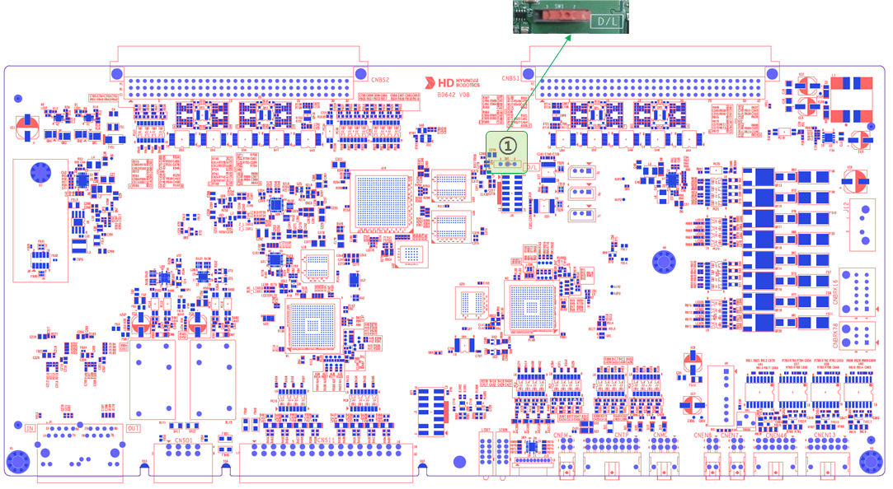
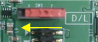
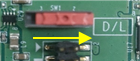

# 4.3.2.4. 설정장치

아래 그림은 서보/안전모듈(BD642)의 설정(스위치)장치 위치를 보여줍니다. 아래 표는 각 설정의 용도를 기술합니다.   
   
   
그림 4.3.2.4-1 서보/안전모듈(BD642)의 설정장치 배치


다음은 사용자가 임의로 변경할 수 없으며, FPGA JTAG을 통한 재프로그래밍이 필요한 경우에만 참고하세요.


표 4.3.2.4-1 서보/안전모듈(BD642) SW1 설정장치 설명   
<table>
<tbody>
  <tr>
    <td><strong>번호</strong></td>
    <td><strong>명칭</strong></td>
    <td><strong>설정상태</strong></td>
    <td><strong>설정내용</strong></td>
    <td><strong>비고</strong></td>
  </tr>
  <tr>
    <td rowspan="2">①</td>
    <td rowspan="2">SW1</td>
    <td></td>
    <td>플래쉬 메모리 부팅 모드</td>
    <td>공장 출하시 셋팅상태</td>
  </tr>
  <tr>
    <td></td>
    <td>JTAG 프로그램 다운로드 모드</td>
    <td>-</td>
  </tr>
</table>
</tbody>

