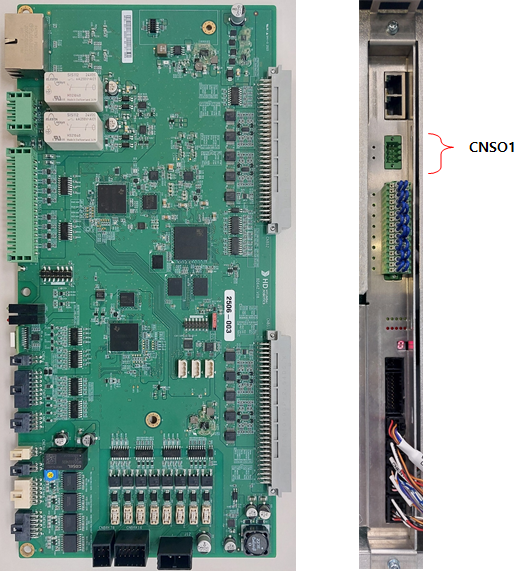
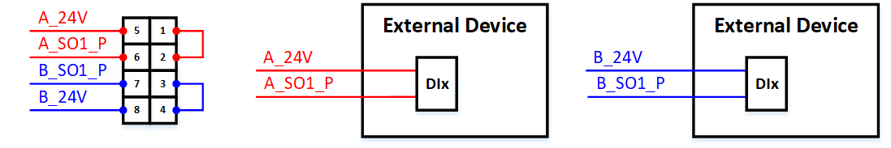
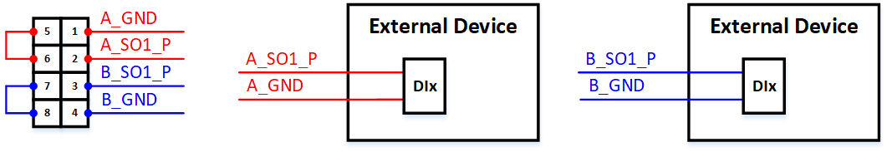
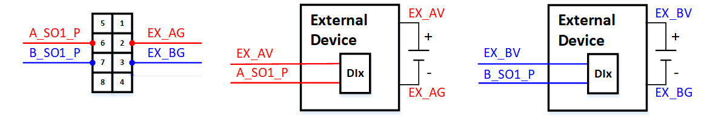
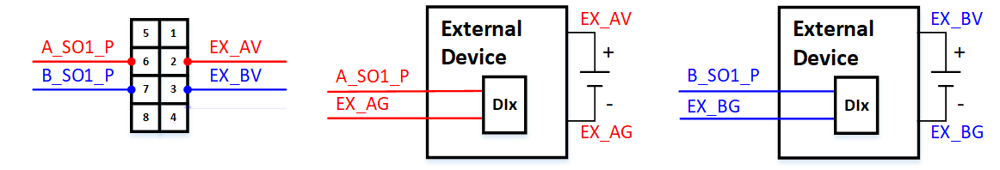

# 4.3.2.5. 安全输出接线


在进行安全输出接线时，确保在开始接线工作之前控制器电源已关闭。


下图显示了伺服/安全模块(BD642)的照片以及在实际安装时从前面看到的安全输出连接器(CNSO1)的位置。

 
图4.3.2.5-1 伺服/安全模块(BD642)的照片及安全输出连接器(CNSO1)的位置

在接线安全输出时，根据是使用内部电源还是外部电源，接线方法有所不同。同时，NPN或PNP类型配置也会有所不同。以下图示显示了每种情况的接线示例。

(1) 使用内部电源时  
* NPN-TYPE(: 低激活)  
在下图中，红色表示A通道，蓝色表示B通道。  
当为A通道使用内部电源时，如下图所示连接连接器CNSO1的引脚1和2。  
当为B通道使用内部电源时，如下图所示连接连接器CNSO1的引脚3和4。  
有关外部设备的连接，请参阅下面的接线示例。

   
图4.3.2.5-2 安全输出接线图（内部电源，NPN类型） - 伺服/安全模块(BD642)   

* PNP-TYPE(: 高激活)  
在下图中，红色表示A通道，蓝色表示B通道。  
当为A通道使用内部电源时，如下图所示连接连接器CNSO1的引脚5和6。  
当为B通道使用内部电源时，如下图所示连接连接器CNSO1的引脚7和8。  
有关外部设备的连接，请参阅下面的接线示例。

   
图4.3.2.5-3 安全输出接线图（内部电源，PNP类型） - 伺服/安全模块(BD642)   

(2) 使用外部电源时  
* NPN-TYPE(: 低激活)  
在下图中，红色表示A通道，蓝色表示B通道。  
连接器CNSO1的引脚1、4、5和8不得连接。  
当为A通道使用外部电源时，如下图所示将EX_AG (GND)连接至连接器CNSO1的引脚2。  
当为B通道使用外部电源时，如下图所示将EX_BG (GND)连接至连接器CNSO1的引脚3。  
有关外部设备的连接，请参阅下面的接线示例。

   
图4.3.2.5-4 安全输出接线图（外部电源，NPN类型） - 伺服/安全模块(BD642)   

* PNP-TYPE(: 高激活)  
在下图中，红色表示A通道，蓝色表示B通道。  
当为A通道使用外部电源时，如下图所示将EX_AV(24V)连接至连接器CNSO1的引脚2。  
当为B通道使用外部电源时，如下图所示将EX_BV(24V)连接至连接器CNSO1的引脚3。  
有关外部设备的连接，请参阅下面的接线示例。

   
图4.3.2.5-5 安全输出接线图（外部电源，PNP类型） - 伺服/安全模块(BD642)