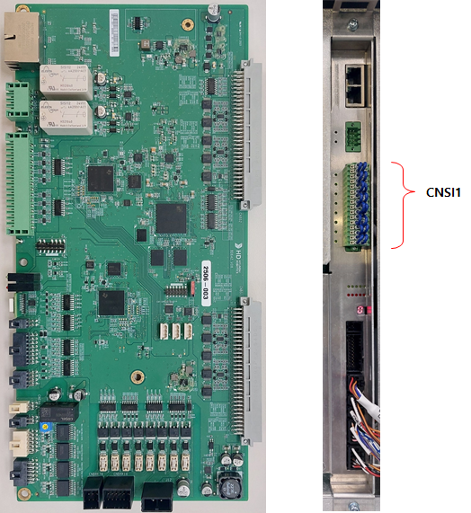
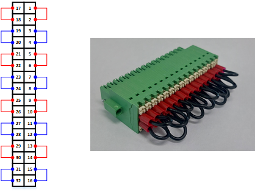
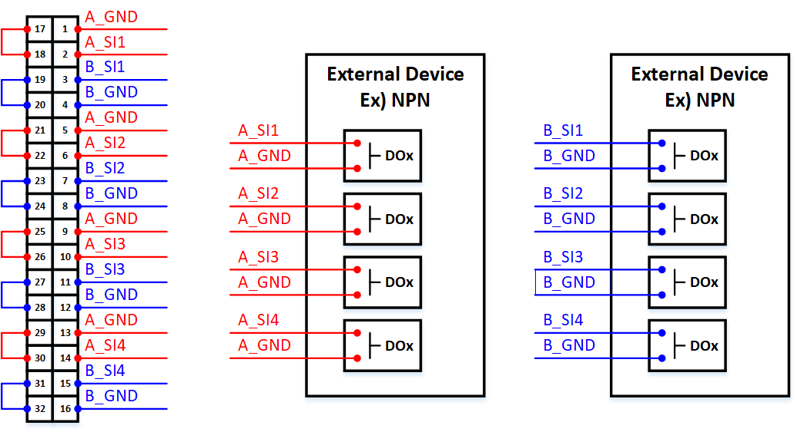
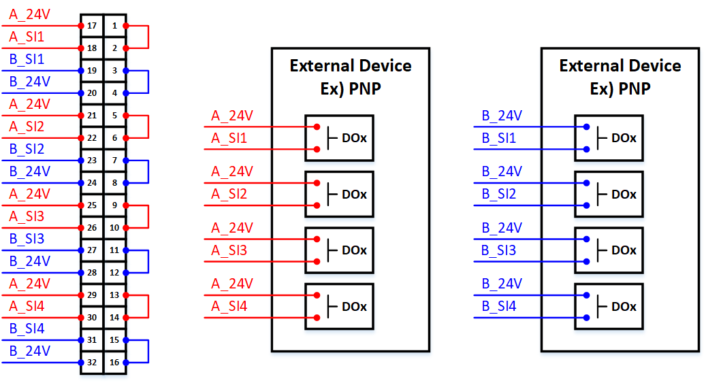
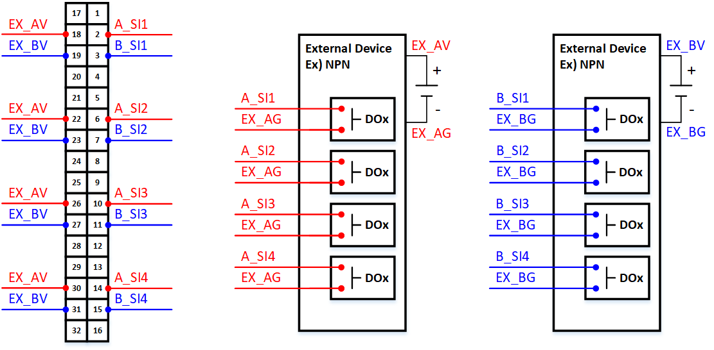
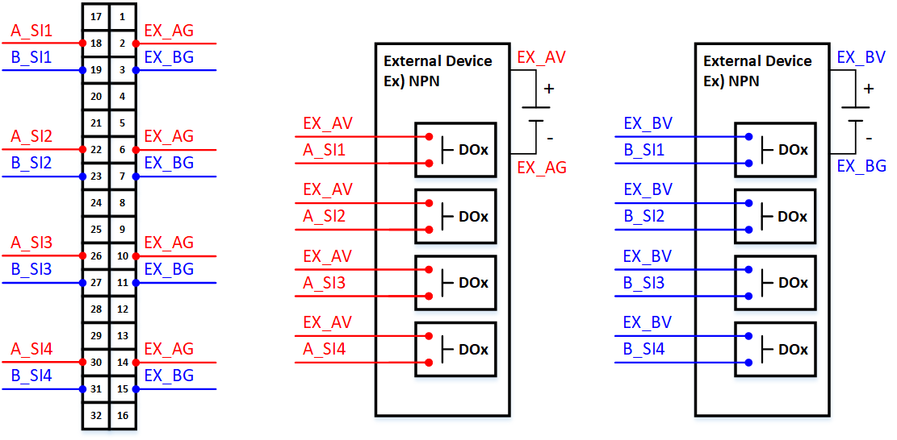

# 4.3.2.6. 安全输入接线


在进行安全输入接线时，请确保在开始接线工作之前，控制器电源已关闭。


下图显示了伺服/安全模块（BD642）的照片以及在实际安装过程中从前方查看的安全输入连接器（CNSI1）位置。

   
图 4.3.2.6-1 伺服/安全模块（BD642）和安全输入连接器（CNSI1）位置的照片

(1) 安全输入出厂默认状态（未使用时）   
如果不使用安全输入信号，必须默认连接为 NC（常闭，B触点）。
下图显示了当安全输入未使用时的接线配置（出厂默认接线状态）。

   
图 4.3.2.6-2 安全输入的出厂默认接线状态 - 伺服/安全模块（BD642）

在接线安全输入时，接线方式因使用内部电源或外部电源而异。它还根据 NPN/PNP 类型配置而不同。以下图显示了每种情况的接线示例。

(2) 使用内部电源时
* NPN-TYPE（: 有效低）   
下图中，红色表示 A 通道，蓝色表示 B 通道。
使用内部电源进行 A 通道时，按照下图所示连接连接器 CNSI1 的以下引脚：
17-18、21-22、25-26 和 29-30。
使用内部电源进行 B 通道时，按照下图所示连接连接器 CNSI1 的以下引脚：
19-20、23-24、27-28 和 31-32。
有关连接外部设备的信息，请参阅下方的接线示例。

   
图 4.3.2.6-3 安全输入接线图（内部电源，NPN 类型） - 伺服/安全模块（BD642）

* PNP-TYPE（: 有效高）   
下图中，红色表示 A 通道，蓝色表示 B 通道。
使用内部电源进行 A 通道时，按照下图所示连接连接器 CNSI1 的以下引脚对：
1-2、5-6、9-10 和 13-14。
使用内部电源进行 B 通道时，按照下图所示连接连接器 CNSI1 的以下引脚对：
3-4、7-8、11-12 和 15-16。
有关连接外部设备的信息，请参阅下方的接线示例。   

   
图 4.3.2.6-4 安全输入接线图（内部电源，PNP 类型） - 伺服/安全模块（BD642）


当将内部电源连接到外部设备时，不能作为设备的电源使用。   


(3) 使用外部电源时
* NPN-TYPE（: 有效低）   
下图中，红色表示 A 通道，蓝色表示 B 通道。
使用外部电源进行 A 通道时，请勿按照下图所示连接连接器 CNSI1 的以下引脚：
1、17、5、21、9、25、13 和 29。
使用外部电源进行 B 通道时，请勿按照下图所示连接连接器 CNSI1 的以下引脚：
4、20、8、24、12、28、16 和 32。
有关连接外部设备的信息，请参阅下方的接线示例。

   
图 4.3.2.6-5 安全输入接线图（外部电源，NPN 类型） - 伺服/安全模块（BD642）

* PNP-TYPE（: 有效高）   
下图中，红色表示 A 通道，蓝色表示 B 通道。
当使用外部电源进行 A 通道时，请勿如图所示连接连接器 CNSI1 的引脚 1、17、5、21、9、25、13 和 29。
当使用外部电源进行 B 通道时，请勿如图所示连接连接器 CNSI1 的引脚 4、20、8、24、12、28、16 和 32。
对外部设备的连接应遵循下方的接线示例。

   
图 4.3.2.6-6 安全输入接线图（外部电源，PNP 类型） - 伺服/安全模块（BD642）