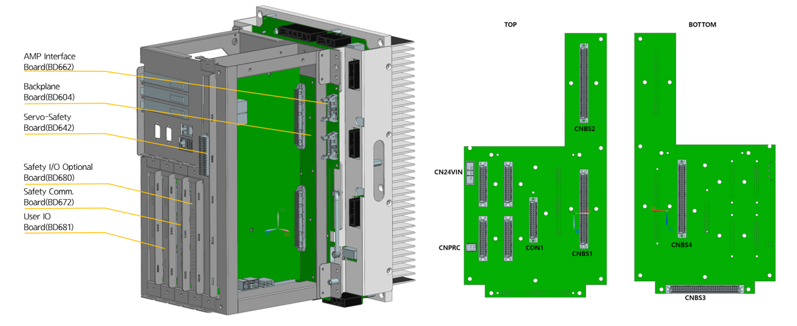
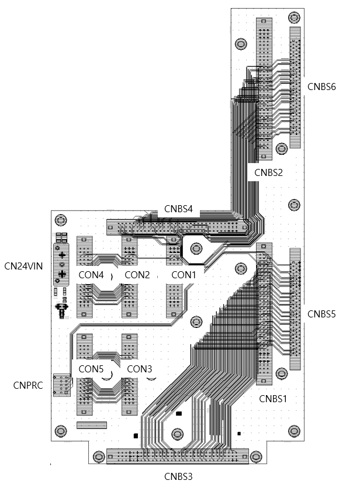

# 4.3.3.1. Overview

The backplane board (BD604), as shown in Figure 4.50, supplies control power to Hi6a boards and transmits AMP-related signals generated from BD642 through the AMP interface board (BD652/BD654). 
It also serves to mount major optional boards and transmit signals between them. 

 
Figure 4.25 Backplane Board Structure 

 
Figure 4.26 Backplane Board Connectors 
