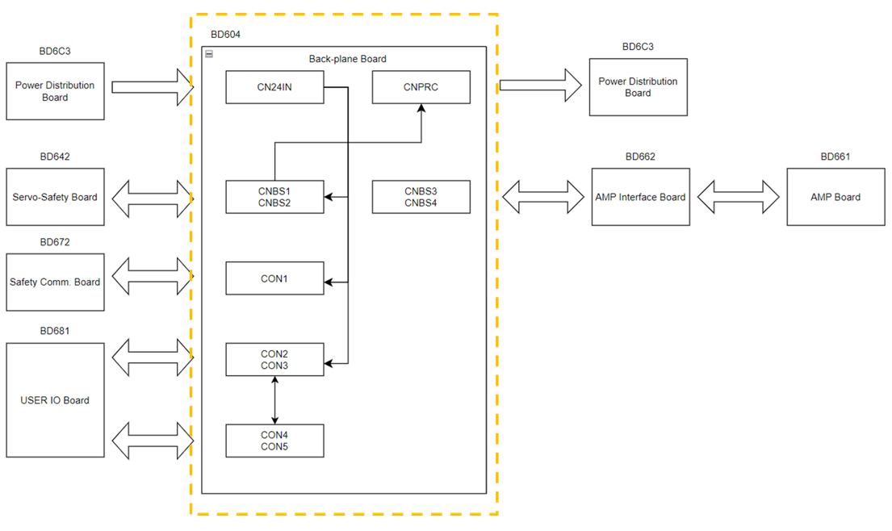

# 4.3.3.2. Connectors

Table 4-9 below describes the function of each connector and its connection to external devices. 

Table 4-9 Types and Functions of Backplane Board Connectors
<table>
<tbody>
<tr class="odd">
<td>
<strong>Name</strong>
</td>
<td>
<strong>Function</strong>
</td>
<td>
<strong>External Device Connection</strong>
</td>
</tr>
<tr class="even">
<td>
<strong>CN24VIN</strong>
</td>
<td>
DC 24V main power supply
</td>
<td>
CNOCM connector on the power distribution board(BD6C3)
</td>
</tr>
<tr class="odd">
<td>
<strong>CNPRC</strong>
</td>
<td>
Precharge relay and fan relay control and monitoring
</td>
<td>
CNPRC connector on the power distribution board(BD6C3)
</td>
</tr>
<tr class="even">
<td>
<strong>CNBS1, CNBS2</strong>
</td>
<td>
Power and signal connector for servo safety board(BD642)
</td>
<td>
CNBS1 and CNBS2 connectors on servo safety board(BD642) 
</td>
</tr>
<tr class="odd">
<td>
<strong>CNBS3, CNBS4</strong>
</td>
<td>
Power and signal connector for AMP interface board(BD652/BD654)
</td>
<td>
CNBS1 and CNBS2 connectors on AMP interface board(BD652/BD654) 
</td>
</tr>
<tr class="even">
<td>
<strong>CNBS5, CNBS6</strong>
</td>
<td>
Power and signal cable connector for AMP interface board(BD652/BD654)
</td>
<td>
-
</td>
</tr>
<tr class="odd">
<td>
<strong>CON1</strong>
</td>
<td>
Power and signal connector for safety communication board(BD671)
</td>
<td>
CN1 connector on safety communication board(BD671)
</td>
</tr>
<tr class="even">
<td>
<strong>CON2, CON3</strong>
</td>
<td>
Power and signal connector for user IO board(BD681)
</td>
<td>
CN3 and CN4 connectors on user IO board(BD681)
</td>
</tr>
<tr class="odd">
<td>
<strong>CON4, CON5</strong>
</td>
<td>
Power and signal connector for user IO expansion board(BD682)
</td>
<td>
CN4 and CN5 connectors on user IO expansion board(BD682)
</td>
</tr>
</tbody>
</table>

The above connector configuration is shown in Figure 4.27. 

 
Figure 4.27 Connector Configuration of Backplane Board 