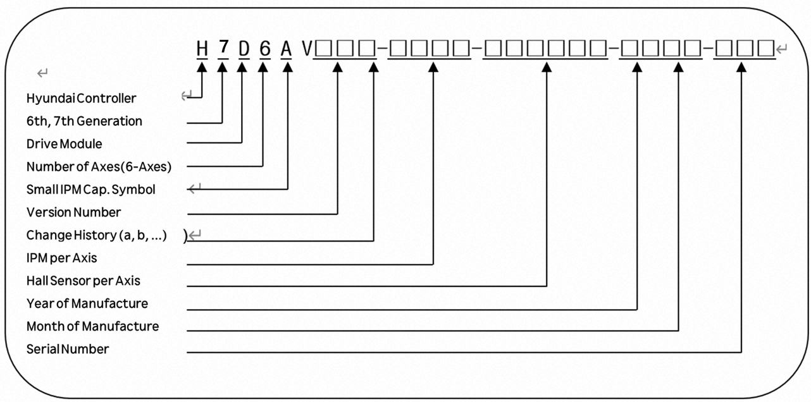
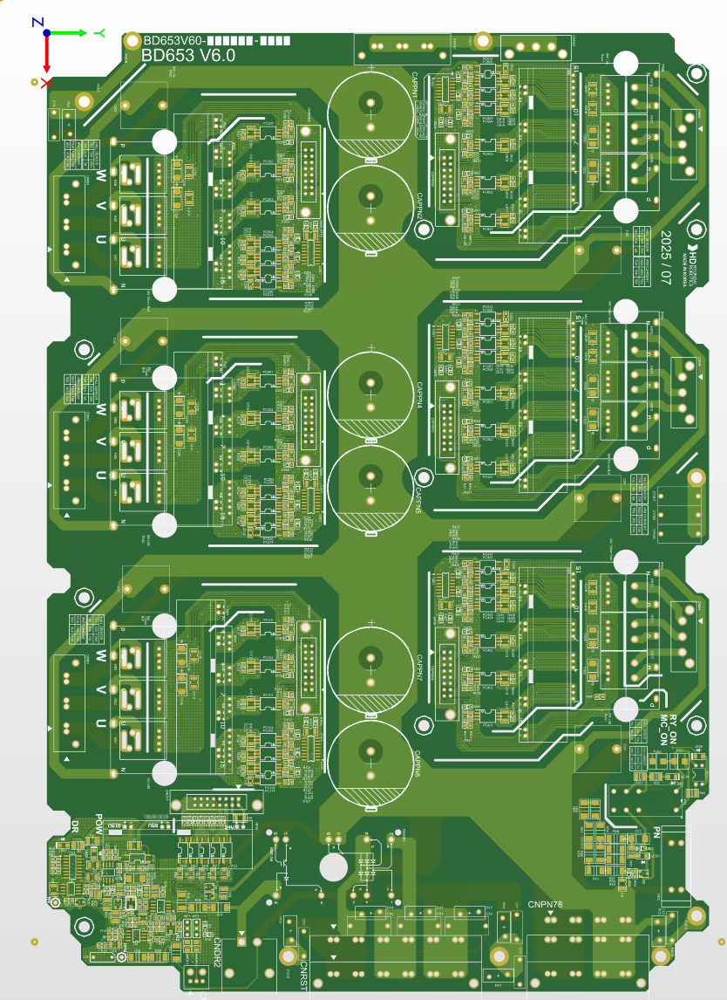
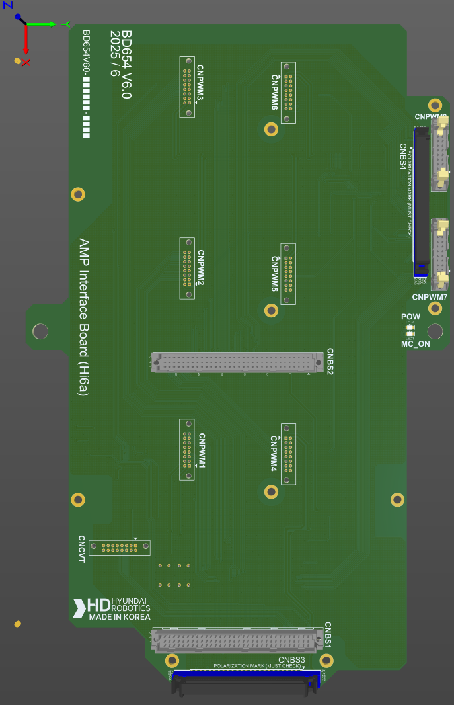

# 4.3.4.2. H7D6A (小型 6 轴集成驱动模块)

驱动模块执行功率放大功能，使电流根据伺服板的电流命令流向电机的各个相位。六轴集成驱动模块可以同时驱动六个电机，其配置如下。

从电源模块输入的三相电流通过二极管模块整流，然后转换为直流电并存储在平滑电容中。当机器人的电机速度减速时，电机产生的电力通过IGBT和电阻消耗。相关配置如下。

表 4-23 H7D6A (小型 6 轴集成驱动模块) 的配置

<table>
<thead>
  <tr>
    <th colspan="2">组件</th>
    <th>组件</th>
  </tr>
</thead>
<tbody>
  <tr>
    <td rowspan="6">BD653 (电源板)</td>
    <td>门驱动电路</td>
    <td>生成 IPM 门信号</td>
  </tr>
  <tr>
    <td>门电源模块</td>
    <td>生成门电源</td>
  </tr>
  <tr>
    <td>电流检测部分</td>
    <td>检测流过电机的电流</td>
  </tr>
  <tr>
    <td>再生控制</td>
    <td>当PN电压上升时开启IGBT</td>
  </tr>
  <tr>
    <td>错误检测部分</td>
    <td>检测过电压、再生电阻过热和欠电压错误</td>
  </tr>
  <tr>
    <td>高电压电容</td>
    <td>平滑直流电</td>
  </tr>
  <tr>
    <td rowspan="2">BD654 (接口板)</td>
    <td>序列联锁部分</td>
    <td>序列状态与伺服开启信号之间的联锁</td>
  </tr>
  <tr>
    <td>专用IO终端块</td>
    <td>控制器内部保留的IO端口</td>
  </tr>
  <tr>
    <td rowspan="4">其他部件</td>
    <td>散热器</td>
    <td>将功率元件中产生的热量释放到外部</td>
  </tr>
  <tr>
    <td>整流部分</td>
    <td>将交流输入电源整流以产生驱动电机的直流电</td>
  </tr>
  <tr>
    <td>再生IGBT</td>
    <td>执行再生放电</td>
  </tr>
  <tr>
    <td>IPM</td>
    <td>转换驱动三相电机的电力</td>
  </tr>
</tbody>
</table>


驱动模块因机器人类型而异，更换时必须检查类型。


### 小型 6 轴集成驱动模块的类型编号配置

表 4-24 小型 6 轴集成驱动模块的类型符号

<table>
<tbody>
<tr class="odd">
<td>
<strong>类别 </strong>
</td>
<td>
<strong>类型符号</strong>
</td>
</tr>
<tr class="even">
<td>
<strong>Hi7 小型 6 轴驱动模块</strong>
</td>
<td>
H7D6A
</td>
</tr>
</tbody>
</table>

表 4-25 小型 6 轴集成驱动模块的规格

<table>
<thead>
  <tr>
    <th>配置</th>
    <th colspan="2">分类</th>
    <th colspan="2">应用</th>
  </tr>
</thead>
<tbody>
  <tr>
    <td>IPM 容量</td>
    <td>3A</td>
    <td>3D</td>
    <td>HA006B, HH020</td>
    <td>6 轴集成 </td>
  </tr>
  <tr>
    <td>年份</td>
    <td colspan="2">00 ~ 99</td>
    <td colspan="2">生产年份：2000-2099</td>
  </tr>
  <tr>
    <td>月份</td>
    <td colspan="2">01 ~ 12</td>
    <td colspan="2">生产月份：一月至十二月</td>
  </tr>
  <tr>
    <td>序列号</td>
    <td colspan="2">001 ~ 999</td>
    <td colspan="2">每月生产单位数量：1~999</td>
  </tr>
</tbody>
</table>

表 4-26 小型 IPM 的容量

<table>
<thead>
  <tr>
    <th>驱动模型</th>
    <th>IPM 符号</th>
    <th>IPM 规格</th>
  </tr>
</thead>
<tbody>
  <tr>
    <td rowspan="7">小型 6 轴的驱动模块</td>
    <td>A</td>
    <td>(IPM 允许电流额定值) 30A</td>
  </tr>
  <tr>
    <td>D</td>
    <td>(IPM 允许电流额定值) 10A</td>
  </tr>
</tbody>
</table>

表 4-27 小型 IPM 的霍尔传感器符号

<table>
<thead>
  <tr>
    <th>驱动模型</th>
    <th>霍尔传感器符号 (规格)</th>
    <th>满量程电流 (Im)</th>
    <th>IPM 规格 (允许电流额定值)</th>
  </tr>
</thead>
<tbody>
  <tr>
    <td rowspan="7">小型 6 轴的驱动模块</td>
    <td>3 (4V/15A)</td>
    <td>27.27Apeak</td>
    <td rowspan="2">6MBP50VAA060 (30A)</td>
  </tr>
  <tr>
    <td>4 (4V/10A)</td>
    <td>18.18Apeak</td>
  </tr>
  <tr>
    <td>5 (4V/5A)</td>
    <td>9.19Apeak</td>
    <td rowspan="2">6MBP20VAA060 (10A)</td>
  </tr>
  <tr>
    <td>6 (4V/3A)</td>
    <td>5.45Apeak</td>
  </tr>
  <tr>
    <td>7 (4V/6A)</td>
    <td>10.91Apeak</td>
    <td>6MBP50VAA060 (30A)</td>
  </tr>
  <tr>
    <td>8 (4V/2A)</td>
    <td>3.64Apeak</td>
    <td rowspan="2">6MBP20VAA060 (10A)</td>
  </tr>
  <tr>
    <td>9 (4V/1A)</td>
    <td>1.82Apeak</td>
  </tr>
</tbody>
</table>


驱动模块因机器人类型而异，更换时必须检查类型。


图 4.22 BD653V60 的部件布置图

表 4-28 BD653 连接器的说明

<table>
<tbody>
<tr class="odd">
<td>
<strong>名称</strong>
</td>
<td>
<strong>用途</strong>
</td>
<td>
<strong>外部设备连接</strong>
</td>
</tr>
<tr class="even">
<td>
<strong>CNPWM1~6</strong>
</td>
<td>
PWM 信号和 IPM 错误信号
</td>
<td>
BD654 的板对板连接器
</td>
</tr>
<tr class="odd">
<td>
<strong>CNRST</strong>
</td>
<td>
三相电源输入
</td>
<td>
用于电子模块的 CNRST
</td>
</tr>
<tr class="even">
<td>
<strong>CNCVT</strong>
</td>
<td>
转换部分错误信号
</td>
<td>
BD654 的板对板连接器
</td>
</tr>
<tr class="odd">
<td>
<strong>CNDR</strong>
</td>
<td>
再生放电功率输出 
</td>
<td>
再生放电电阻
</td>
</tr>
<tr class="even">
<td>
<strong>CNTR</strong>
</td>
<td>
再生放电电阻过热检测
</td>
<td>
再生放电电阻温度传感器
</td>
</tr>
<tr class="odd">
<td>
<strong>CNM1~6</strong>
</td>
<td>
电机驱动输出
</td>
<td>
CMC1
</td>
</tr>
<tr class="even">
<td>
<strong>CNPN7~8</strong>
</td>
<td>
用于附加轴的驱动模块的直流电
</td>
<td>
可选附加轴的驱动模块的 CNPN
</td>
</tr>
<tr class="odd">
<td>
<strong>CNFG1, CNFG4</strong>
</td>
<td>
电机的框架接地
</td>
<td>
CMC1
</td>
</tr>
</tbody>
</table>

表 4-29 BD653 的 LED 说明

<table>
<tbody>
<tr class="odd">
<td>
<strong>名称</strong>
</td>
<td>
<strong>颜色</strong>
</td>
<td>
<strong>状态显示</strong>
</td>
</tr>
<tr class="even">
<td>
<strong>MC ON</strong>
</td>
<td>
黄色
</td>
<td>
当磁体接触驱动时将点亮
</td>
</tr>
<tr class="odd">
<td>
<strong>POW</strong>
</td>
<td>
绿色
</td>
<td>
当转换部分的控制电压正常时将点亮
</td>
</tr>
<tr class="even">
<td>
<strong>DR</strong>
</td>
<td>
红色
</td>
<td>
当再生放电工作时将点亮
</td>
</tr>
<tr class="odd">
<td>
<strong>PN</strong>
</td>
<td>
红色
</td>
<td>
当 PN 电压高于 42V 时将点亮
</td>
</tr>
<tr class="even">
<td>
<strong>RYON</strong>
</td>
<td>
红色
</td>
<td>
当 PN 放电操作开始时将熄灭
</td>
</tr>
</tbody>
</table>

图 4.23 BD654 的部件布置图  

表 4-30 BD654 连接器的说明

<table>
<tbody>
<tr class="odd">
<td>
<strong>名称</strong>
</td>
<td>
<strong>用途</strong>
</td>
<td>
<strong>外部设备连接</strong>
</td>
</tr>
<tr class="even">
<td>
<strong>CNBS1~3</strong>
</td>
<td>
8 轴的 PWM 信号和 IPM 错误信号 转换部分错误信号
</td>
<td>
BD642 的板对板连接器
</td>
</tr>
<tr class="odd">
<td>
<strong>CNPWM1~6</strong>
</td>
<td>
各个轴的 PWM 信号和 IPM 错误信号
</td>
<td>
BD653 的板对板连接器
</td>
</tr>
<tr class="even">
<td>
<strong>CNPWM7~8</strong>
</td>
<td>
附加轴的 PWM 信号和 IPM 错误信号
</td>
<td>
附加轴驱动模块 (BD 658 或 BD 659) 的 CNPWM
</td>
</tr>
<tr class="odd">
<td>
<strong>CNCVT</strong>
</td>
<td>
转换部分错误信号
</td>
<td>
BD653 的板对板连接器
</td>
</tr>
<tr class="even">
<td>
<strong>TBIO</strong>
</td>
<td>
仅限保留 IO 端子块
</td>
<td>
保留
</td>
</tr>
</tbody>
</table>

表 4-31 BD654 的 LED 说明

<table>
<tbody>
<tr class="odd">
<td>
<strong>名称</strong>
</td>
<td>
<strong>颜色</strong>
</td>
<td>
<strong>状态显示</strong>
</td>
</tr>
<tr class="even">
<td>
<strong>MC</strong>
</td>
<td>
黄色
</td>
<td>
当磁体接触驱动时将点亮
</td>
</tr>
<tr class="odd">
<td>
<strong>POW</strong>
</td>
<td>
绿色
</td>
<td>
当控制电源正常时将点亮
</td>
</tr>
</tbody>
</table>