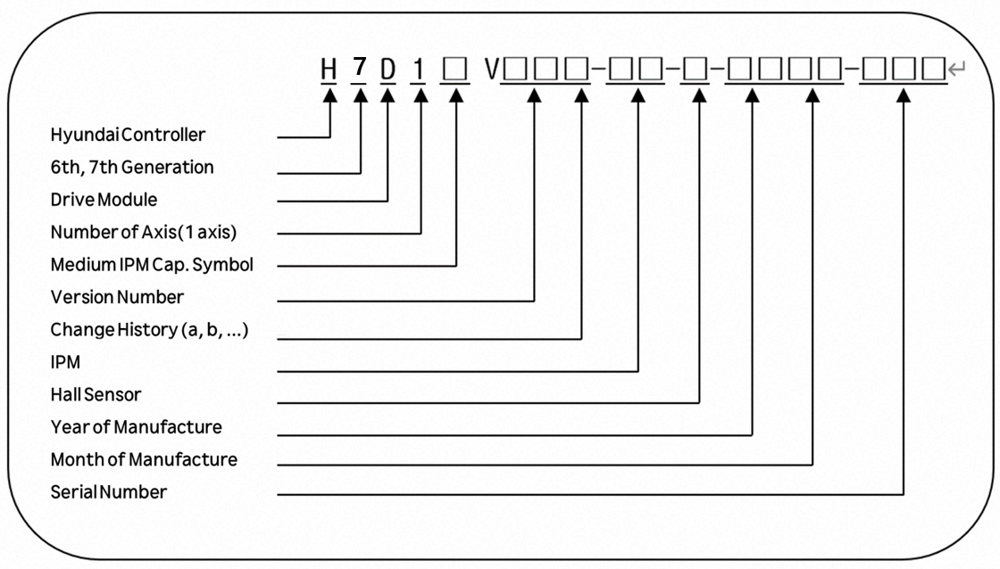

# 4.3.4.3. Specification of the Optional Drive Module

### Configuration of the Type Number of the Optional Drive Module

Table 4-32 Type Symbol of the Optional Drive Module

<table>
<thead>
  <tr>
    <th>Category</th>
    <th>Type symbol</th>
  </tr>
</thead>
<tbody>
  <tr>
    <td>Hi7 1 Axes drive module</td>
    <td>H7D1</td>
  </tr>
</tbody>
</table>

Table 4-33 Capacity of the IPM of the Optional Drive Module

<table>
<thead>
  <tr>
    <th>Drive Model</th>
    <th>IPM symbol</th>
    <th>IPM Specification</th>
  </tr>
</thead>
<tbody>
  <tr>
    <td rowspan="6">Drive module of the additional axis</td>
    <td>X</td>
    <td>(IPM current rating) 100A</td>
  </tr>
  <tr>
    <td>Y</td>
    <td>(IPM current rating) 75A</td>
  </tr>
  <tr>
    <td>Z</td>
    <td>(IPM current rating) 50A</td>
  </tr>
</tbody>
</table>

Table 4-34 Symbols of the Hall Sensors of the Optional Drive Module

<table>
<thead>
  <tr>
    <th>Drive Model</th>
    <th>Hall sensor symbol(Specification) Full-scale current (Im)</th>
    <th>Full-scale current(Im)</th>
    <th>IPM specification (Rated current</th>
  </tr>
</thead>
<tbody>
  <tr>
    <td rowspan="6">Drive module of the additional axis</td>
  </tr>
  <tr>
    <td>1 (4V/50A)</td>
    <td>93.75Apeak</td>
    <td rowspan="5">PM100CG1APL065 202G (100A) PM75CG1APL065 202G (75A) PM50CG1APL065 202G (50A)</td>
  </tr>
  <tr>
    <td>2 (4V/25A)</td>
    <td>46.87Apeak</td>
  </tr>
  <tr>
    <td>3 (4V/15A)</td>
    <td>28.12Apeak</td>
  </tr>
  <tr>
    <td>4 (4V/10A)</td>
    <td>18.75Apeak</td>
  </tr>
  <tr>
    <td>5 (4V/5A)</td>
    <td>9.37Apeak</td>
  </tr>
</tbody>
</table>
