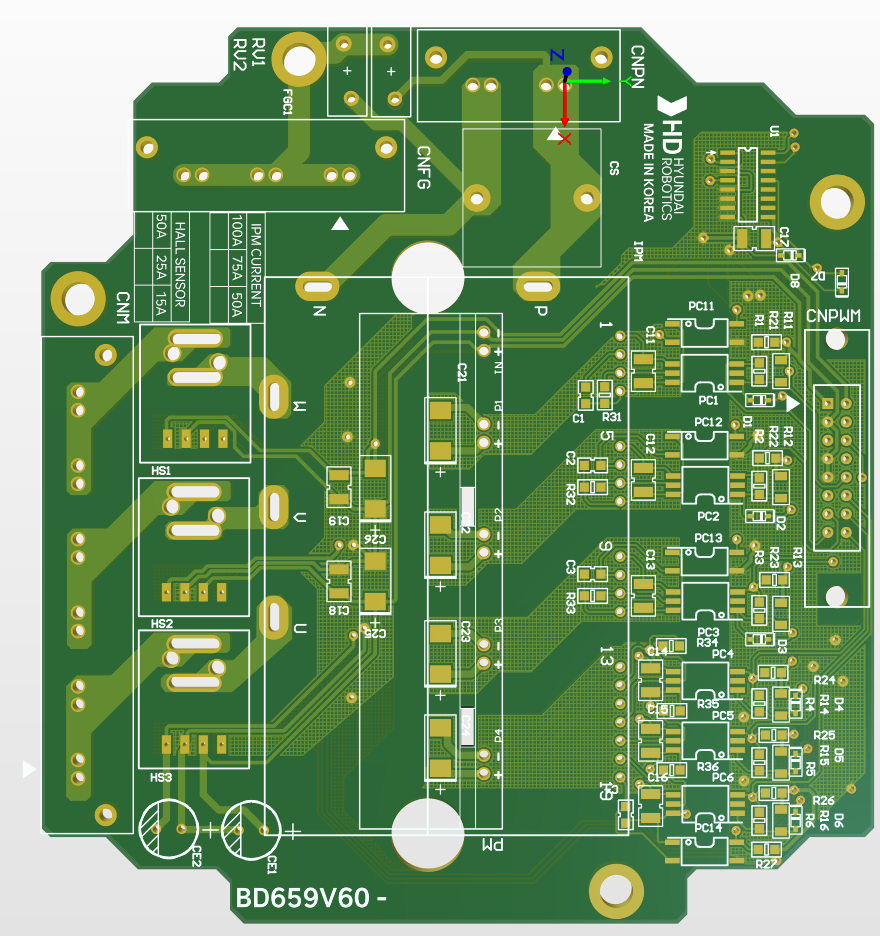

# 4.3.4.5. H7D1Z (伺服枪驱动模块; 可选)

驱动模块执行功率放大功能，使电流根据伺服板的当前命令流向电机的各个相。伺服枪驱动模块可以驱动一个50A或以下的电机，配置如下。

图4.25 H7D1Z的BD659V60部件布置图  

表4-37 H7D1Z的配置

<table>
<thead>
  <tr>
    <th colspan="2">组件</th>
    <th>功能</th>
  </tr>
</thead>
<tbody>
  <tr>
    <td rowspan="3">BD659 (IPM板)</td>
    <td>逻辑部分</td>
    <td>将从驱动模块接收的六个轴的PWM信号转换为IPM的上下两侧驱动信号，并处理错误</td>
  </tr>
  <tr>
    <td>门电源模块</td>
    <td>生成IPM门电源</td>
  </tr>
  <tr>
    <td>电流检测部分</td>
    <td>检测流经电机的电流</td>
  </tr>
  <tr>
    <td rowspan="2">其他部分</td>
    <td>散热器</td>
    <td>将IPM中产生的热量释放到外部</td>
  </tr>
  <tr>
    <td>IPM</td>
    <td>为驱动三相电机转换电源</td>
  </tr>
</tbody>
</table>

表4-38 H7D1Z连接器的描述

<table>
<thead>
  <tr>
    <th>名称</th>
    <th>用途</th>
    <th>外部设备连接</th>
  </tr>
</thead>
<tbody>
  <tr>
    <td>CNPWM</td>
    <td>PWM信号和错误信号</td>
    <td>驱动模块（BD652或BD654）的CNPWM7或CNPWM8，用于6个轴</td>
  </tr>
  <tr>
    <td>CNM</td>
    <td>电机驱动输出</td>
    <td>AMC1或AMC2</td>
  </tr>
  <tr>
    <td>CNFG</td>
    <td>电机的框架接地</td>
    <td>AMC1或AMC2</td>
  </tr>
  <tr>
    <td>CNPN</td>
    <td>驱动直流电源输入</td>
    <td>驱动模块（BD651或BD653）的CNPN7或CNPN8，用于6个轴</td>
  </tr>
</tbody>
</table>