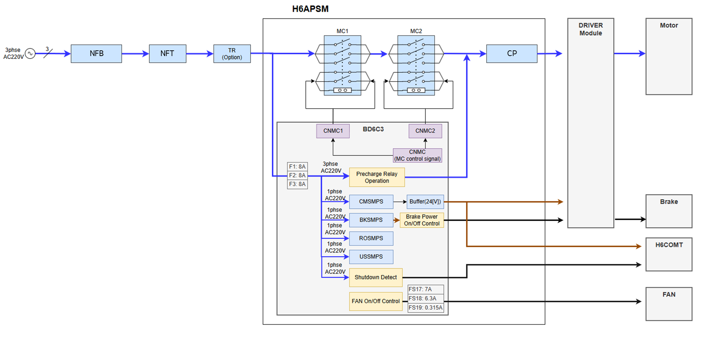

# 4.3.5.1. H6PSM and Power Distribution Board(BD6C3)

The H6PSM (Hi7-N controller power supply module) module is responsible for the opening and closing and distribution of various power supplied to the controller. The following figures show the interior and exterior of the electrical module with diverse connectors and fuses.

_외부_en.png  ) 
Figure 4.34 Exterior of H6PSM (Hi7-N Controller Power Supply Module) 

The following figure shows the power system diagram for the AC control power related to the opening and closing of the 3-phase AC power for the motor power, the generation of the brake power, and the driving of the fan. The diagram in the figure also shows the power distribution, such as the SMPS power for the DC power supply to the control module. A circuit breaker (CP) or fuse is connected to each power to protect individual circuits against overcurrent. 

 
Figure 4.35 Power System of the Hi7-N Controller 

Table 4-35 Types and Usage of the Fuses of the Electronic Module 
<table>
<thead>
  <tr>
    <th>Name</th>
    <th>Function</th>
    <th>Specification</th>
  </tr>
</thead>
<tbody>
  <tr>
    <td>F1, F2, F3</td>
    <td>Fuse for overcurrent protection of control power(AC 220V)</td>
    <td>AC220V 8A</td>
  </tr>
  <tr>
    <td>FS17</td>
    <td>Fuse for overcurrent protection of CMDCFAN and DCFAN2–5 GND</td>
    <td>7VAC/60VDC 7A</td>
  </tr>
  <tr>
    <td>FS18</td>
    <td>Fuse for overcurrent protection of DCFAN2–5</td>
    <td>125VAC/125VDC 6.3A</td>
  </tr>
  <tr>
    <td>FS19</td>
    <td>Fuse for overcurrent protection of the DC fan for control module cooling</td>
    <td>125VAC/125VDC 0.315A</td>
  </tr>
</tbody>
</table>
