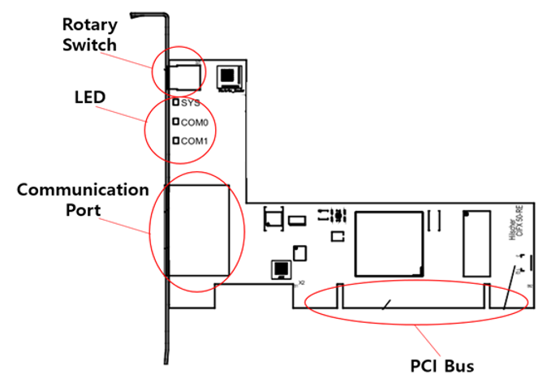

# 5.1.2. PCI通信卡的配置

PCI通信卡基本上配置如下（当使用基于以太网的通信时），并根据工业通信的类型而有所不同，连接器和LED的数量也会有所不同。

 
图5.1 PCI通信卡的外观 

表5-3 PCI通信卡外观的描述
<table>
<thead>
  <tr>
    <th>名称</th>
    <th>用途</th>
  </tr>
</thead>
<tbody>
  <tr>
    <td>旋转开关</td>
    <td>根据插槽ID设置通信</td>
  </tr>
  <tr>
    <td>LED</td>
    <td>显示系统和通信状态</td>
  </tr>
  <tr>
    <td>通信端口</td>
    <td>通信连接端口</td>
  </tr>
  <tr>
    <td>PCI总线</td>
    <td>PC连接总线</td>
  </tr>
</tbody>
</table>