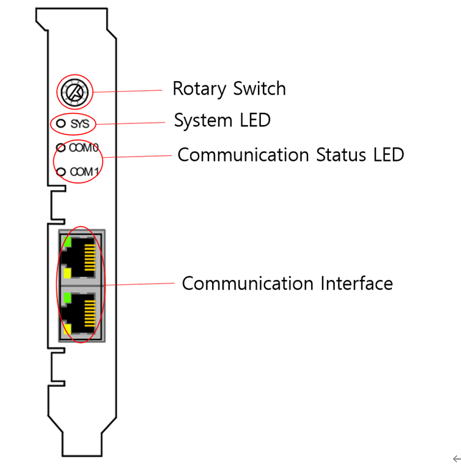

# 5.1.3. PCI通信卡的前面部分

您可以通过PCI通信卡的前面部分检查通信设置、通信电缆连接和通信状态。基本上，您可以通过根据H6COM-T PCI插槽的位置将旋转开关按顺序设置为1-4来使用该卡。

 
图5.2 PCI通信卡的前面部分 

表5-4 PCI通信卡前面部分的配置及功能描述
<table>
<thead>
  <tr>
    <th>名称</th>
    <th>用途</th>
    <th>功能描述</th>
  </tr>
</thead>
<tbody>
  <tr>
    <td>旋转开关</td>
    <td>为每个插槽编号设置通信</td>
    <td>H6COM-T PCI插槽固定为从顶部开始的#1~#4顺序（通信应从TP设置）。</td>
  </tr>
  <tr>
    <td>系统LED</td>
    <td>系统状态检查LED</td>
    <td>绿色：系统运行中 黄色：引导加载程序等待</td>
  </tr>
  <tr>
    <td>通信状态LED</td>
    <td>通信状态检查LED</td>
    <td>绿色：通信正在进行中 红色：通信错误</td>
  </tr>
  <tr>
    <td>通信接口</td>
    <td>通信电缆连接端口</td>
    <td>使用适合通信的连接器</td>
  </tr>
</tbody>
</table>