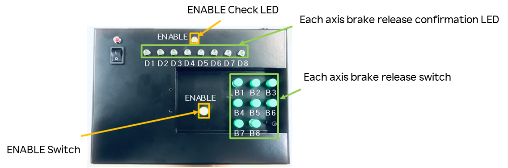

# 5.2.2. 刹车释放开关

刹车释放单元开关的放置如图5.3所示，其各自的使用和操作在表5-4中描述。要释放目标轴的刹车，首先按下启用按钮，然后在按住启用按钮的同时，按下B1-B8中的一个按钮。然后，相关轴将被释放。

图5.3 刹车释放单元的开关和状态检查LED  

表5-4 刹车释放单元开关的使用

<table>
<thead>
  <tr>
    <th>名称</th>
    <th>用途</th>
    <th>操作时</th>
  </tr>
</thead>
<tbody>
  <tr>
    <td>E</td>
    <td>刹车释放启用</td>
    <td>黄色启用LED亮</td>
  </tr>
  <tr>
    <td>B1</td>
    <td>轴1刹车释放</td>
    <td>绿色D1 LED亮</td>
  </tr>
  <tr>
    <td>B2</td>
    <td>轴2刹车释放</td>
    <td>绿色D2 LED亮</td>
  </tr>
  <tr>
    <td>B3</td>
    <td>轴3刹车释放</td>
    <td>绿色D3 LED亮</td>
  </tr>
  <tr>
    <td>B4</td>
    <td>轴4刹车释放</td>
    <td>绿色D4 LED亮</td>
  </tr>
  <tr>
    <td>B5</td>
    <td>轴5刹车释放</td>
    <td>绿色D5 LED亮</td>
  </tr>
  <tr>
    <td>B6</td>
    <td>轴6刹车释放</td>
    <td>绿色D6 LED亮</td>
  </tr>
  <tr>
    <td>B7</td>
    <td>轴7刹车释放</td>
    <td>绿色D7 LED亮</td>
  </tr>
  <tr>
    <td>B8</td>
    <td>轴8刹车释放</td>
    <td>绿色D8 LED亮</td>
  </tr>
</tbody>
</table>