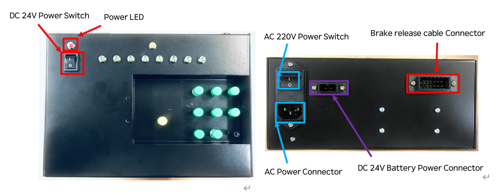

# 5.2.3. 电源和连接器 

刹车释放单元的电源和连接器的放置如下图5.4所示，其各自的使用和连接设备如下表5-5所示。


- 使用刹车释放单元时，请遵循以下步骤。
1. 关闭AC220V电源开关，并检查DC24V电源开关是否关闭。
2. 将交流电源电缆连接到交流电源连接器。
3. 打开AC220V电源开关。
4. 打开DC24V电源开关。

- 使用刹车释放单元结束后，请遵循以下步骤。
1. 关闭DC24V电源开关。
2. 关闭AC220V电源开关。
4. 拔掉交流电源电缆。

- 请勿同时使用AC220V电源和DC24V电池电源。



我们公司（或制造商）对于因未遵循上述“注意事项”而发生的任何事故概不负责。


 
图5.4 刹车释放单元的开关和连接器  

表5-5 刹车释放单元连接器的类型和用法

<table>
<thead>
  <tr>
    <th>名称</th>
    <th>用途</th>
    <th>外部设备连接</th>
  </tr>
</thead>
<tbody>
  <tr>
    <td>AC 220V电源连接器和开关</td>
    <td>交流电源的应用</td>
    <td>100V AC~240V AC 单相</td>
  </tr>
  <tr>
    <td>刹车释放电缆连接连接器</td>
    <td>刹车释放单元与控制器的连接</td>
    <td>CNBRK16, CNB78的BD642</td>
  </tr>
  <tr>
    <td>DC24V电池电源连接器</td>
    <td>便携式24V电池的电源连接</td>
    <td>便携式24V电池</td>
  </tr>
  <tr>
    <td>DC24V电源开关</td>
    <td>刹车释放单元驱动开/关</td>
    <td>无</td>
  </tr>
</tbody>
</table>