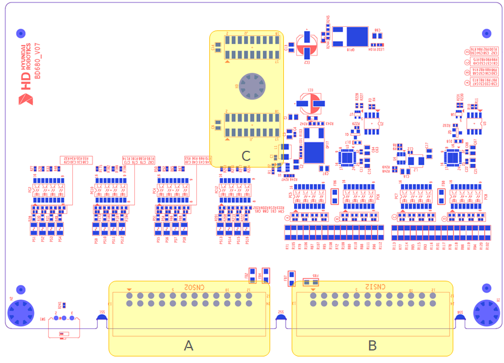

# 5.4.2. 커넥터

아래 그림은 옵션 안전IO모듈(BD680)의 외부연결에 필요한 커넥터의 위치를 보여줍니다. 또한, 아래 표는 각 커넥터의 명칭, 용도를 기술합니다.

   
그림 5.4.2-1 옵션 안전IO모듈(BD680)커넥터 배치   

표 5.4.2-1 옵션 안전IO모듈(BD680)커넥터 명칭, 용도 및 외부연결장치   
<table>
<thead>
  <tr>
    <th><strong>번호</strong></th>
    <th><strong>명칭</strong></th>
    <th><strong>용도</strong></th>
    <th><strong>외부연결장치</strong></th>
  </tr>
</thead>
<tbody>
  <tr>
    <td>A</td>
    <td>CNSO2</td>
    <td>안전 출력단자</td>
    <td>외부 디바이스</td>
  </tr>
  <tr>
    <td>B</td>
    <td>CNSI2</td>
    <td>안전 입력단자</td>
    <td>외부 디바이스</td>
  </tr>
  <tr>
    <td>C</td>
    <td>J1
       J2</td>
    <td>BD642연결 커넥터(Board to Board)</td>
    <td>서보/안전모듈(BD642)</td>
  </tr>
</tbody>
</table>


안전관련 입력을 연결하여 활성화를 한경우 반드시 “1.11. 로봇 조작시 안전대책”을 참고하여 기능 정상 동작 여부를 확인하여 주십시오.
