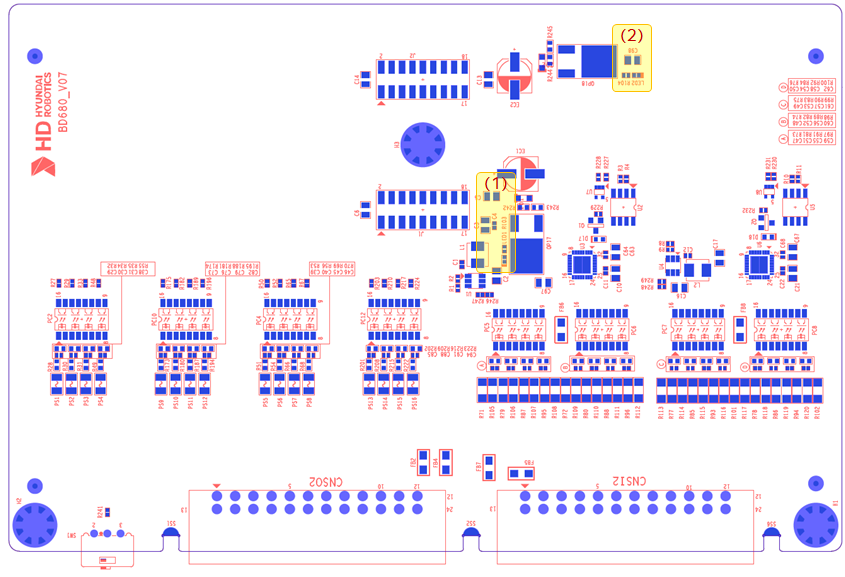
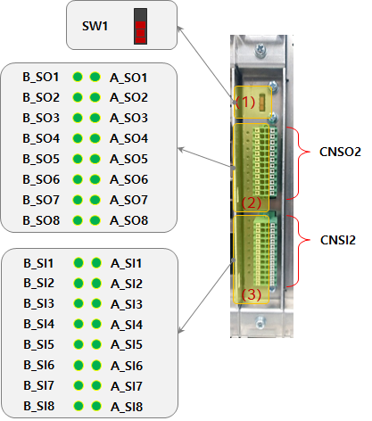

# 5.4.3. 표시장치

(1) 보드 TOP면 표시 장치   

아래 그림은 옵션 안전IO모듈(BD680)의 표시(LED)장치 위치를 보여줍니다. 아래 표는 각 표시의 내용을 기술합니다.

   
그림 5.4.3-1 옵션 안전IO모듈(BD680)의 표시장치 배치   

표 5.4.3-1 옵션 안전IO모듈(BD680)의 표시장치 설명   

<table>
<thead>
  <tr>
    <th><strong>번호</strong></th>
    <th><strong>명칭</strong></th>
    <th><strong>표시내용</strong></th>
    <th><strong>색상</strong></th>
    <th><strong>정상시</strong></th>
    <th><strong>이상시 조치내용</strong></th>
  </tr>
</thead>
<tbody>
  <tr>
    <td>(1)</td>
    <td>LED1</td>
    <td>A채널 전원 표시</td>
    <td>노란색</td>
    <td>점등</td>
    <td>
      현상 : 노란색 소등
       원인 : A채널 입력전원 이상
       조치1 : A채널 입력전원(24V) 확인
       조치2 : 퓨즈(FS1) 확인
    </td>
  </tr>
  <tr>
    <td>(2)</td>
    <td>LED2</td>
    <td>B채널 전원 표시</td>
    <td>노란색</td>
    <td>점등</td>
    <td>
      현상 : 노란색 소등
       원인 : B채널 입력전원 이상
       조치1 : B채널 입력전원(24V) 확인
       조치2 : 퓨즈(FS2) 확인
    </td>
</table>
</tbody>

(2) 보드 전면 표시 장치   

아래 그림은 옵션 안전IO모듈(BD680)의 전면 표시 장치를 보여줍니다. 아래 표는 각 표시의 내용을 기술합니다.

   
그림 5.4.3-2 옵션 안전IO모듈(BD680)의 전면 표시장치 배치   

표 5.4.3-2 옵션 안전IO모듈(BD680) 전면 표시장치 설명   
<table>
<thead>
  <tr>
    <th><strong>번호</strong></th>
    <th><strong>명칭</strong></th>
    <th><strong>표시내용</strong></th>
    <th><strong>색상</strong></th>
    <th><strong>표시상태</strong></th>
    <th><strong>표시상태 설명</strong></th>
  </tr>
</thead>
<tbody>
  <tr>
    <td>(1)</td>
    <td>SW1</td>
    <td></td>
    <td></td>
    <td></td>
    <td>향후 사용 예정</td>
  </tr>
  <tr>
    <td rowspan="2">(2)</td>
    <td>A_SOx 
        (x=1~8)</td>
    <td>A채널 안전출력x 상태표시</td>
    <td rowspan="2">녹색</td>
    <td rowspan="2">점등 소등</td>
    <td rowspan="2">각 채널 안전출력x ON 상태  
                    각 채널 안전출력x OFF 상태</td>
  </tr>
  <tr>
    <td>B_SOx 
        (x=1~8)</td>
    <td>B채널 안전출력x 상태표시</td>
  </tr>

  <tr>
    <td rowspan="2">(3)</td>
    <td>A_SIx 
        (x=1~8)</td>
    <td>A채널 안전입력x 상태표시</td>
    <td rowspan="2">녹색 </td>
    <td rowspan="2">점등 소등</td>
    <td rowspan="2">각 채널 안전입력x ON 상태  
                    각 채널 안전입력x OFF 상태</td>
  </tr>
  <tr>
    <td>B_SIx 
        (x=1~8)</td>
    <td>B채널 안전입력x 상태표시</td>
  </tr>
</table>
</tbody>
