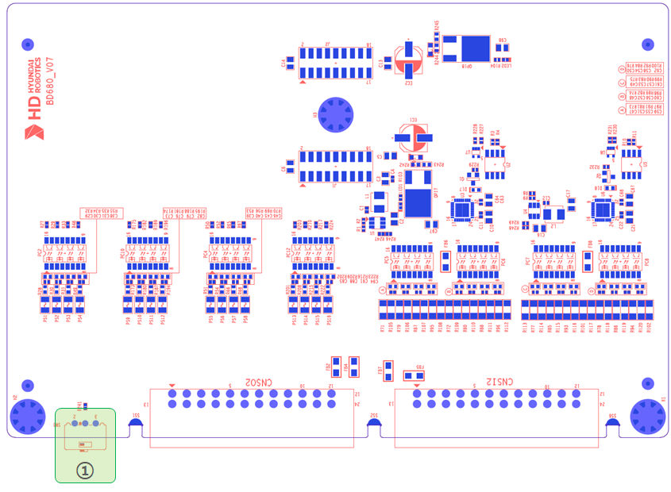

# 5.4.4. 设置设备

下图显示了可选安全IO模块(BD680)上设置(开关)设备的位置。下表描述了每个设置的目的。

   
图 5.4.4-1 可选安全IO模块(BD680)上设置设备的布局

表 5.4.4-1 设置设备(SW1)描述 – 可选安全IO模块(BD680)  
<table>
<thead>
  <tr>
    <th><strong>序号</strong></th>
    <th><strong>名称</strong></th>
    <th><strong>设置状态</strong></th>
    <th><strong>设置功能</strong></th>
    <th><strong>备注</strong></th>
  </tr>
</thead>
<tbody>
  <tr>
    <td>①</td>
    <td>SW1</td>
    <td>-</td>
    <td>-</td>
    <td>保留供将来使用</td>
  </tr>
</table>
</tbody>