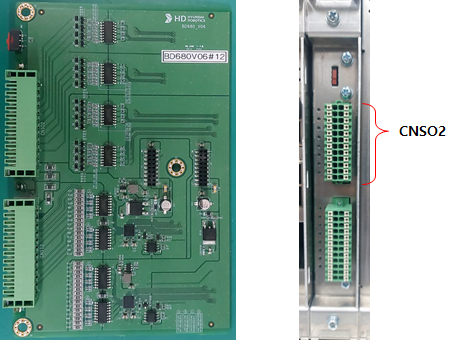
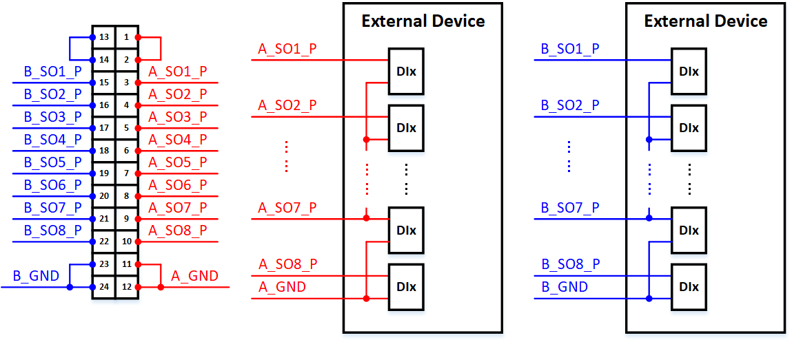
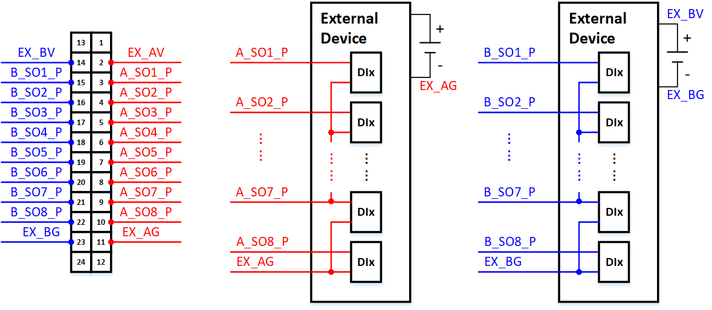

# 5.4.5. 安全输出接线


在接线安全输出时，始终确保控制器电源在进行任何接线工作之前处于关闭状态。


下图显示了实际的可选安全IO模块(BD680)以及在安装时从前方看到的安全输出连接器的位置。

  
图5.4.5-1 可选安全IO模块(BD680)-前视图和安全输出连接器位置

接线方法取决于使用内部电源或外部电源。以下部分说明了每种情况的接线方式。

(1) 使用内部电源  
下图中，红色代表A通道，蓝色代表B通道。  
A通道(内部电源)：如图所示，将连接器CNSO2的引脚1-2和11-12连接。  
B通道(内部电源)：如图所示，将连接器CNSO2的引脚13-14和23-24连接。  
有关连接到外部设备的接线示例，请参见下面的接线示例。

  
图5.4.5-2 可选安全IO模块(BD680)-使用内部电源的安全输出接线

(2) 使用外部电源  
下图中，红色代表A通道，蓝色代表B通道。  
连接器CNSO2的引脚1、12、13和24未连接。  
A通道(外部电源)：将EX_AV(24V)连接到引脚2，将EX_AG(GND)连接到引脚11。  
B通道(外部电源)：将EX_BV(24V)连接到引脚14，将EX_BG(GND)连接到引脚23。  
有关连接到外部设备的接线示例，请参见下面的接线示例。

  
图5.4.5-3 可选安全IO模块(BD680)-使用外部电源的安全输出接线