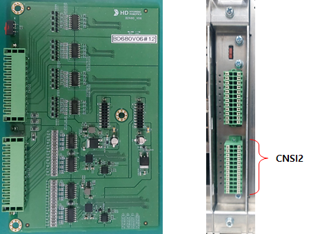
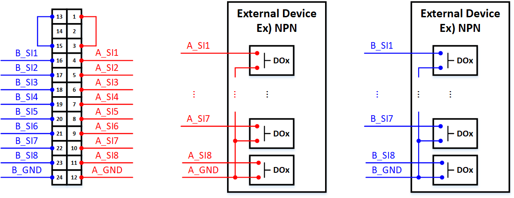
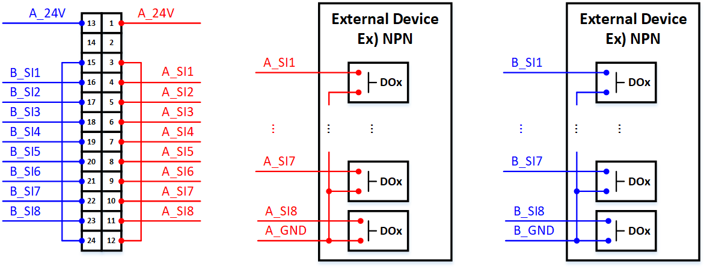
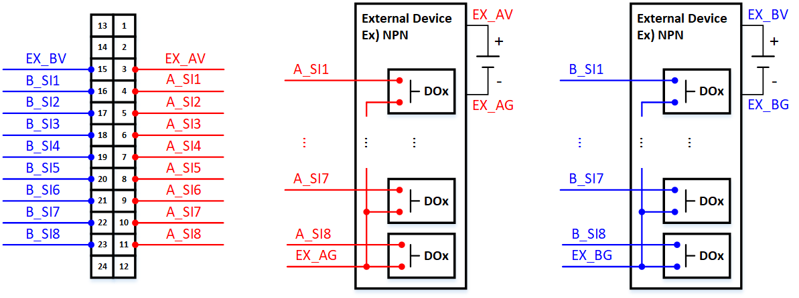

# 5.4.6. 안전입력 결선


안전입력 결선 작업 시, 반드시 제어기 전원을 OFF한 상태에서 결선작업 하시기 바랍니다.


아래 그림은 옵션 안전IO모듈(BD680) 실물사진과 실제 설치 시, 전면에서 보았을 때의 커넥터 위치를 보여줍니다.    

  
그림 5.4.6-1 옵션 안전IO모듈(BD680) 실물사진과 안전입력 커넥터 위치   

안전입력 결선시, 내부전원과 외부전원 사용할 경우의 결선이 다르고 NPN/PNP 타입에 따라서도 다릅니다. 아래는 각각의 경우에 대한 결선을 보여줍니다.   

(1) 내부전원 사용시   
* NPN-TYPE(: Active Low)   
아래 그림의 빨간색은 A채널을 나타내고 파란색은 B채널을 나타냅니다.  
A채널 내부전원을 사용하는 경우, 아래 그림과 같이 커넥터 CNSI2의 1번-3번 핀을 연결합니다.  
B채널 내부전원을 사용하는 경우, 아래 그림과 같이 커넥터 CNSI2의 13번-15번 핀을 연결합니다.  
외부 디바이스와의 연결은 아래 결선 예를 참조하여 결선합니다.     

   
그림 5.4.6-2 옵션 안전IO모듈(BD680) 안전입력 내부전원 NPN-TYPE 사용시 결선도   

* PNP-TYPE(: Active High)   
아래 그림의 빨간색은 A채널을 나타내고 파란색은 B채널을 나타냅니다.  
A채널 내부전원을 사용하는 경우, 아래 그림과 같이 커넥터 CNSI2의 3번-12번 핀을 연결합니다.  
B채널 내부전원을 사용하는 경우, 아래 그림과 같이 커넥터 CNSI2의 15번-24번 핀을 연결합니다.  
외부 디바이스와의 연결은 아래 결선 예를 참조하여 결선합니다.  

   
그림 5.4.6-3 옵션 안전IO모듈(BD680) 안전입력 내부전원 PNP-TYPE 사용시 결선도   


내부전원을 외부 장치와 결선할 때, 장치의 전원으로 사용해서는 안됩니다.
  

(2) 외부전원 사용시   
* NPN-TYPE(: Active Low)  
아래 그림의 빨간색은 A채널을 나타내고 파란색은 B채널을 나타냅니다.  
A채널 외부전원을 사용하는 경우, 아래 그림과 같이 커넥터 CNSI2의 1번, 12번 핀을 연결하지 않으며 외부전원(EX_AV)는 3번 핀에 연결합니다.  
B채널 외부전원을 사용하는 경우, 아래 그림과 같이 커넥터 CNSI2의 13번, 24번 핀을 연결하지 않으며 외부전원(EX_BV)는 15번 핀에 연결합니다.  
외부 디바이스와의 연결은 아래 결선 예를 참조하여 결선합니다.  

   
그림 5.4.6-4 옵션 안전IO모듈(BD680) 안전입력 외부전원 NPN-TYPE 사용시 결선도   

* PNP-TYPE(: Active High)   
아래 그림의 빨간색은 A채널을 나타내고 파란색은 B채널을 나타냅니다.  
A채널 외부전원을 사용하는 경우, 아래 그림과 같이 커넥터 CNSI2의 1번, 12번 핀을 연결하지 않으며 외부전원(EX_AG)는 3번 핀에 연결합니다.  
B채널 외부전원을 사용하는 경우, 아래 그림과 같이 커넥터 CNSI2의 13번, 24번 핀을 연결하지 않으며 외부전원(EX_BG)는 15번 핀에 연결합니다.  
외부 디바이스와의 연결은 아래 결선 예를 참조하여 결선합니다.  

   
그림 5.4.6-5 옵션 안전IO모듈(BD680) 안전입력 외부전원 PNP-TYPE 사용시 결선도

