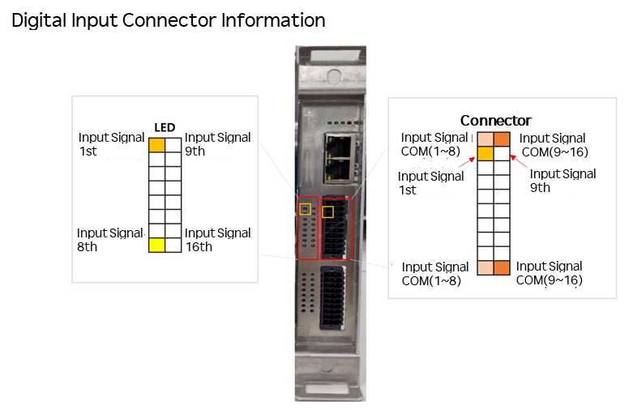
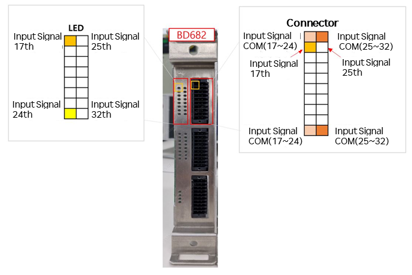

# 5.5.2.1 Digital Input

The following figure and table show the pin configuration of the terminal blocks for digital inputs. Each terminal block can receive 16 input signals, supporting NPN or PNP type inputs depending on the application. When BD682 is additionally mounted, 16 digital inputs are added. Refer to the function manual for how to configure NPN and PNP signals. 

 
| No. | Signal Name   | Description   |No. | Signal Name | Description |
|------|---------|---------- |-----|-------- |----------|
| 1    |COM_IN_A |COM Signal (1~8)    | 11 | COM_IN_B | COM Signal (9~16) |        
| 2    |A1|Digital input 1| 12 | B1 |Digital input 9    |
| 3    |A2|Digital input 2| 13 | B2 |Digital input 10   |
| 4    |A3|Digital input 3| 14 | B3 |Digital input 11   |
| 5    |A4|Digital input 4| 15 | B4 |Digital input 12   |
| 6    |A5|Digital input 5| 16 | B5 |Digital input 13   |
| 7    |A6|Digital input 6| 17 | B6 |Digital input 14   |
| 8    |A7|Digital input 7| 18 | B7 |Digital input 15   |
| 9    |A8|Digital input 8| 19 | B8 |Digital input 16   |
| 10   | COM_IN_A| COM Signal (1~8)  |  20 | COM_IN_B  | COM Signal (9~16)|  

When extended DIO board (BD682) is additionally mounted, the pin map is as follows: 

 
| No. | Signal Name   | Description   |No. | Signal Name | Description |
|------|---------|---------- |-----|-------- |----------|
| 1    |COM_IN_A |COM Signal (1~8)    | 11 | COM_IN_B | COM Signal (9~16) |        
| 2    |A9|Digital input 1| 12 | B1 |Digital input 9    |
| 3    |A10|Digital input 2| 13 | B2 |Digital input 10   |
| 4    |A11|Digital input 3| 14 | B3 |Digital input 11   |
| 5    |A12|Digital input 4| 15 | B4 |Digital input 12   |
| 6    |A13|Digital input 5| 16 | B5 |Digital input 13   |
| 7    |A14|Digital input 6| 17 | B6 |Digital input 14   |
| 8    |A7|Digital input 7| 18 | B7 |Digital input 15   |
| 9    |A8|Digital input 8| 19 | B8 |Digital input 16   |
| 10   | COM_IN_A| COM Signal (1~8)  |  20 | COM_IN_B  | COM Signal (9~16)|  
           
