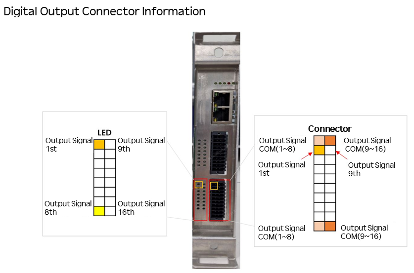
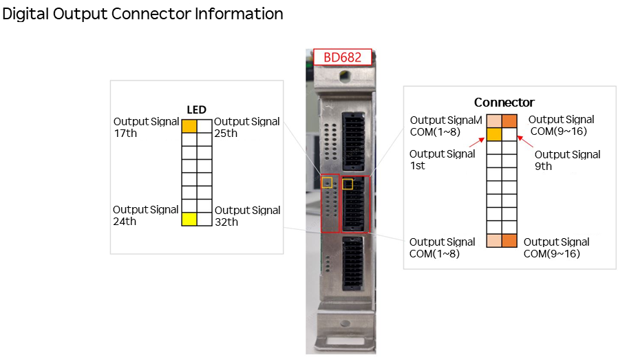

# 5.5.2.2 Digital Output

The following figure and table show the pin configuration of the terminal blocks for digital outputs. Each terminal block can transmit 16 output signals, supporting NPN or PNP type outputs depending on the application. 
When BD682 is additionally mounted, 16 digital outputs are added. 

 

| No. | Signal Name   | Description   |No. | Signal Name | Description |
|------|---------|---------- |-----|-------- |----------|
| 1    |COM_OUT_A |COM Signal (1~8)    | 11 | COM_OUT_B | COM Signal (9~16) |        
| 2    |A1|Digital output 1| 12 | B1 |Digital output 9    |
| 3    |A2|Digital output 2| 13 | B2 |Digital output 10   |
| 4    |A3|Digital output 3| 14 | B3 |Digital output 11   |
| 5    |A4|Digital output 4| 15 | B4 |Digital output 12   |
| 6    |A5|Digital output 5| 16 | B5 |Digital output 13   |
| 7    |A6|Digital output 6| 17 | B6 |Digital output 14   |
| 8    |A7|Digital output 7| 18 | B7 |Digital output 15   |
| 9    |A8|Digital output 8| 19 | B8 |Digital output 16   |
| 10   | COM_OUT_A| COM Signal (1~8)  |  20 | COM_OUT_B  | COM Signal (9~16)|  

확장DIO보드(BD682) 추가 장착 시 핀맵 은 아래와 같습니다. 
 
| No. | Signal Name   | Description   |No. | Signal Name | Description |
|------|---------|---------- |-----|-------- |----------|
| 1    |COM_OUT_A |COM Signal (17~24)    | 11 | COM_OUT_B | COM Signal (25~32) |        
| 2    |A9|Digital output 17| 12 | B9 |Digital output 25    |
| 3    |A10|Digital output 18| 13 | B10 |Digital output 26   |
| 4    |A11|Digital output 19| 14 | B11 |Digital output 27   |
| 5    |A12|Digital output 20| 15 | B12 |Digital output 28   |
| 6    |A13|Digital output 21| 16 | B13 |Digital output 29   |
| 7    |A14|Digital output 22| 17 | B14 |Digital output 30   |
| 8    |A15|Digital output 23| 18 | B15 |Digital output 31   |
| 9    |A16|Digital output 24| 19 | B16 |Digital output 32   |
| 10   | COM_OUT_A| COM Signal (17~24)  |  20 | COM_OUT_B  | COM Signal (25~32)|  

