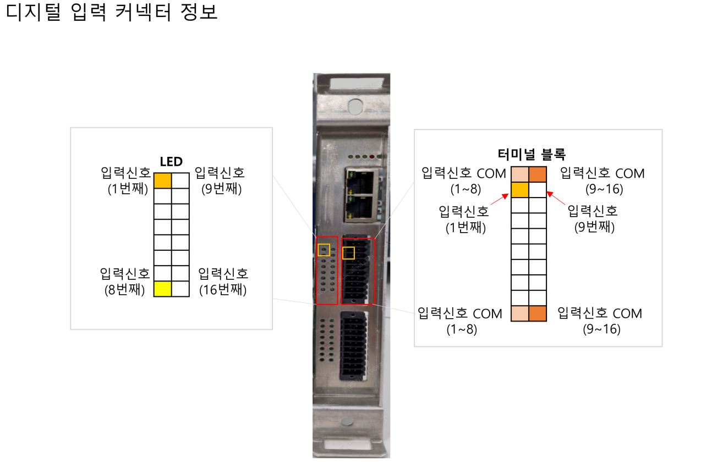
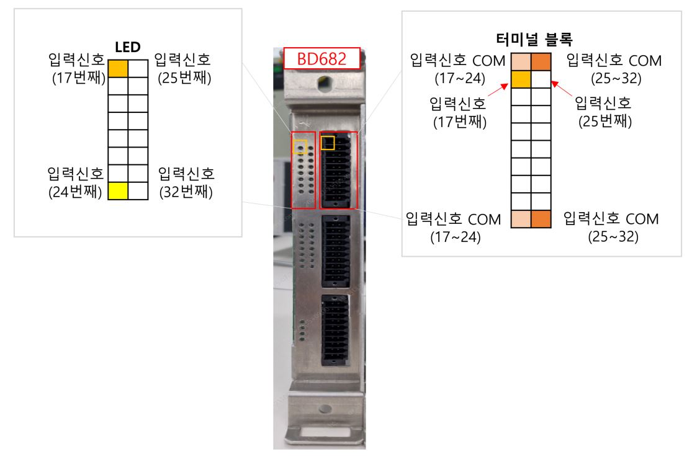
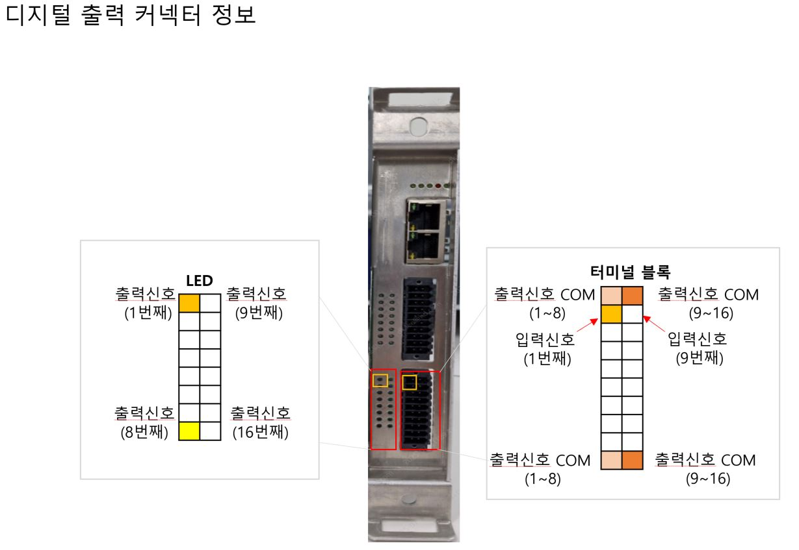
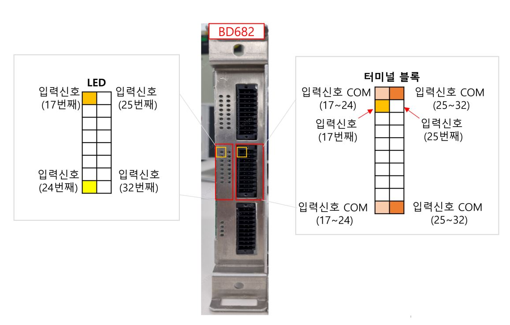
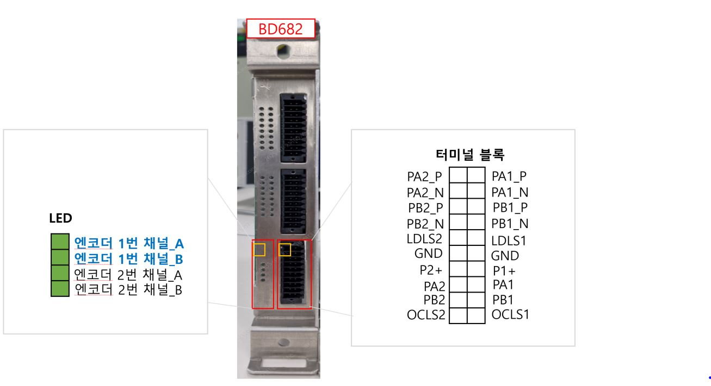

# 5.5.2 하드웨어 정보
사용자IO모듈(BD681)을 사용하여 각종 장치들과 디지털 입출력 포트를 통하여 연계 또는 구성이 가능합니다. 
또한 확장IO모듈(BD682)를 통해 디지털 입출력 포트 추가 및 컨베이어 시스템과의 동기화를 할 수 있습니다. 
기본적인 보드의 하드웨어 구성은 아래와 같습니다. 
 

# 5.5.2.1 디지털 입력
다음의 그림과 표는 디지털 입력용 터미널 블록의 핀 구성을 나타낸 것입니다. 
각 터미널 블록은 16개의 입력 신호를 받을 수 있으며, 용도에 따라 NPN, PNP 타입의 입력을 받을 수 있습니다. 
BD682를 추가 장착을 하게 되면, 디지털 입력 16pt가 추가 됩니다.  
NPN,PNP 신호를 구성하는 방법은 기능 설명서를 참조하시기 바랍니다. 
 
| 번호 | 신호명   | 신호 설명  |번호 | 신호명 | 신호 설명 |
|------|---------|---------- |-----|-------- |----------|
| 1    |COM_IN_A |COM 신호 (1~8)    | 11 | COM_IN_B | COM 신호 (9~16) |        
| 2    |A1|디지털 입력1| 12 | B1 |디지털 입력9    |
| 3    |A2|디지털 입력2| 13 | B2 |디지털 입력10   |
| 4    |A3|디지털 입력3| 14 | B3 |디지털 입력11   |
| 5    |A4|디지털 입력4| 15 | B4 |디지털 입력12   |
| 6    |A5|디지털 입력5| 16 | B5 |디지털 입력13   |
| 7    |A6|디지털 입력6| 17 | B6 |디지털 입력14   |
| 8    |A7|디지털 입력7| 18 | B7 |디지털 입력15   |
| 9    |A8|디지털 입력8| 19 | B8 |디지털 입력16   |
| 10   | COM_IN_A| COM 신호 (1~8)  |  20 | COM_IN_B  | COM 신호 (9~16)|  

확장DIO보드(BD682) 추가 장착 시 핀맵 은 아래와 같습니다. 
 
| 번호 | 신호명   | 신호 설명  |번호 | 신호명 | 신호 설명 |
|------|---------|---------- |-----|-------- |----------|
| 1    |COM_IN_A |COM 신호 (1~8)    | 11 | COM_IN_B | COM 신호 (9~16) |        
| 2    |A9|디지털 입력1| 12 | B1 |디지털 입력9    |
| 3    |A10|디지털 입력2| 13 | B2 |디지털 입력10   |
| 4    |A11|디지털 입력3| 14 | B3 |디지털 입력11   |
| 5    |A12|디지털 입력4| 15 | B4 |디지털 입력12   |
| 6    |A13|디지털 입력5| 16 | B5 |디지털 입력13   |
| 7    |A14|디지털 입력6| 17 | B6 |디지털 입력14   |
| 8    |A7|디지털 입력7| 18 | B7 |디지털 입력15   |
| 9    |A8|디지털 입력8| 19 | B8 |디지털 입력16   |
| 10   | COM_IN_A| COM 신호 (1~8)  |  20 | COM_IN_B  | COM 신호 (9~16)|  
           
# 5.5.2.2 디지털 출력
다음의 그림과 표는 디지털 출력용 터미널 블록의 핀 구성을 나타낸 것입니다. 
각 터미널 블록은 16개의 출력 신호를 받을 수 있으며, 용도에 따라 NPN, PNP 타입의 출력을 받을 수 있습니다. 
BD682를 추가 장착을 하게 되면, 디지털 출력 16pt가 추가 됩니다. 
 

| 번호 | 신호명   | 신호 설명  |번호 | 신호명 | 신호 설명 |
|------|---------|---------- |-----|-------- |----------|
| 1    |COM_OUT_A |COM 신호 (1~8)    | 11 | COM_OUT_B | COM 신호 (9~16) |        
| 2    |A1|디지털 출력1| 12 | B1 |디지털 출력9    |
| 3    |A2|디지털 출력2| 13 | B2 |디지털 출력10   |
| 4    |A3|디지털 출력3| 14 | B3 |디지털 출력11   |
| 5    |A4|디지털 출력4| 15 | B4 |디지털 출력12   |
| 6    |A5|디지털 출력5| 16 | B5 |디지털 출력13   |
| 7    |A6|디지털 출력6| 17 | B6 |디지털 출력14   |
| 8    |A7|디지털 출력7| 18 | B7 |디지털 출력15   |
| 9    |A8|디지털 출력8| 19 | B8 |디지털 출력16   |
| 10   | COM_OUT_A| COM 신호 (1~8)  |  20 | COM_OUT_B  | COM 신호 (9~16)|  

확장DIO보드(BD682) 추가 장착 시 핀맵 은 아래와 같습니다. 
 
| 번호 | 신호명   | 신호 설명  |번호 | 신호명 | 신호 설명 |
|------|---------|---------- |-----|-------- |----------|
| 1    |COM_OUT_A |COM 신호 (17~24)    | 11 | COM_OUT_B | COM 신호 (25~32) |        
| 2    |A9|디지털 출력17| 12 | B9 |디지털 출력25    |
| 3    |A10|디지털 출력18| 13 | B10 |디지털 출력26   |
| 4    |A11|디지털 출력19| 14 | B11 |디지털 출력27   |
| 5    |A12|디지털 출력20| 15 | B12 |디지털 출력28   |
| 6    |A13|디지털 출력21| 16 | B13 |디지털 출력29   |
| 7    |A14|디지털 출력22| 17 | B14 |디지털 출력30   |
| 8    |A15|디지털 출력23| 18 | B15 |디지털 출력31   |
| 9    |A16|디지털 출력24| 19 | B16 |디지털 출력32   |
| 10   | COM_OUT_A| COM 신호 (17~24)  |  20 | COM_OUT_B  | COM 신호 (25~32)|  

# 5.5.2.3 컨베이어 동기화 구성
다음의 그림은 컨베이어 동기화를 위한 엔코더 입력 및 리밋 스위치로 구성 되어 있습니다. 
총 2개의 입력 채널로 구성되어 있으며, 입력 채널의 구성은 다음과 같습니다.
각 채널 당, 2종류의 엔코더 타입(오픈컬렉터/라인드라이버)으로 설정 되어 있습니다.  
 

| 번호 | 신호명   | 신호 설명  |번호 | 신호명 | 신호 설명 |
|------|---------|---------- |-----|-------- |----------|
| 1    |PA2_P    |2번 채널 라인드라이버 타입 엔코더   A신호 입력 Positive| 11 | PA1_P |1번 채널 라인드라이버 타입 엔코더   A신호 입력 Positive|        
| 2    |PA2_N    |2번 채널 라인드라이버 타입 엔코더   A신호 입력 Negative| 12 | PA1_N |1번 채널 라인드라이버 타입 엔코더   A신호 입력 Negative|
| 3    |PB2_P    |2번 채널 라인드라이버 타입 엔코더   B신호 입력 Positive| 13 | PB1_P |1번 채널 라인드라이버 타입 엔코더   B신호 입력 Positive |
| 4    |PB2_N    |2번 채널 라인드라이버 타입 엔코더   B신호 입력 Negative| 14 | PB1_N |2번 채널 라인드라이버 타입 엔코더   B신호 입력 Negative |
| 5    |LDLS2    |2번 채널 라인드라이버 타입 엔코더   리밋 스위치 | 15 | LDLS1 |디지털 출력28   |
| 6    |GND      |접지 | 16 | GND |접지   |
| 7    |P2+      |2번 채널 오픈컬렉터 엔코더 전원 | 17 | P1+ |1번 채널 오픈컬렉터 엔코더 전원   |
| 8    |A2       |2번 채널 오픈컬렉터 타입 엔코더   A 신호 입력| 18 | A1 |1번 채널 오픈컬렉터 타입 엔코더   A 신호 입력  |
| 9    |B2       |2번 채널 오픈컬렉터 타입 엔코더   B 신호 입력| 19 | B1 |1번 채널 오픈컬렉터 타입 엔코더   B 신호 입력   |
| 10   |OCLS2    |2번 채널 오픈컬렉터 타입 엔코더   리밋 스위치  |  20 | OCLS1  | 1번 채널 오픈컬렉터 타입 엔코더   리밋 스위치|  