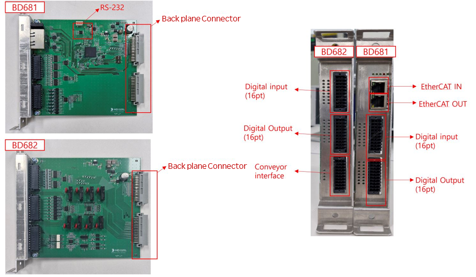
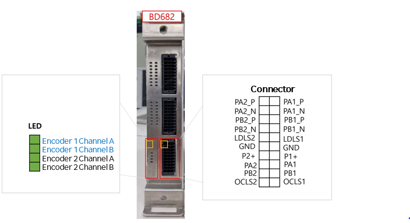

# 5.5.2 硬件信息
用户 IO 模块 (BD681) 允许通过数字输入/输出端口连接和配置各种设备。
此外，扩展 IO 模块 (BD682) 允许增加数字 I/O 端口并与输送系统同步。 
电路板的基本硬件配置如下：

 

### 5.5.2.1 数字输入
下图和表格显示了数字输入端子块的引脚配置。每个端子块可接收 16 个输入信号，根据应用支持 NPN 或 PNP 类型输入。当附加安装 BD682 时，将增加 16 个数字输入。有关如何配置 NPN 和 PNP 信号，请参见功能手册。

 
| No. | 信号名称   | 描述   |No. | 信号名称 | 描述 |
|------|---------|---------- |-----|-------- |----------|
| 1    |COM_IN_A |COM 信号 (1~8)    | 11 | COM_IN_B | COM 信号 (9~16) |        
| 2    |A1|数字输入 1| 12 | B1 |数字输入 9    |
| 3    |A2|数字输入 2| 13 | B2 |数字输入 10   |
| 4    |A3|数字输入 3| 14 | B3 |数字输入 11   |
| 5    |A4|数字输入 4| 15 | B4 |数字输入 12   |
| 6    |A5|数字输入 5| 16 | B5 |数字输入 13   |
| 7    |A6|数字输入 6| 17 | B6 |数字输入 14   |
| 8    |A7|数字输入 7| 18 | B7 |数字输入 15   |
| 9    |A8|数字输入 8| 19 | B8 |数字输入 16   |
| 10   | COM_IN_A| COM 信号 (1~8)  |  20 | COM_IN_B  | COM 信号 (9~16)|  

当附加安装扩展 DIO 板 (BD682) 时，引脚图如下： 

 
| No. | 信号名称   | 描述   |No. | 信号名称 | 描述 |
|------|---------|---------- |-----|-------- |----------|
| 1    |COM_IN_A |COM 信号 (1~8)    | 11 | COM_IN_B | COM 信号 (9~16) |        
| 2    |A9|数字输入 1| 12 | B1 |数字输入 9    |
| 3    |A10|数字输入 2| 13 | B2 |数字输入 10   |
| 4    |A11|数字输入 3| 14 | B3 |数字输入 11   |
| 5    |A12|数字输入 4| 15 | B4 |数字输入 12   |
| 6    |A13|数字输入 5| 16 | B5 |数字输入 13   |
| 7    |A14|数字输入 6| 17 | B6 |数字输入 14   |
| 8    |A7|数字输入 7| 18 | B7 |数字输入 15   |
| 9    |A8|数字输入 8| 19 | B8 |数字输入 16   |
| 10   | COM_IN_A| COM 信号 (1~8)  |  20 | COM_IN_B  | COM 信号 (9~16)|  
           
### 5.5.2.2 数字输出
下图和表格显示了数字输出端子块的引脚配置。每个端子块可传输 16 个输出信号，根据应用支持 NPN 或 PNP 类型输出。 
当附加安装 BD682 时，将增加 16 个数字输出。 

 

| No. | 信号名称   | 描述   |No. | 信号名称 | 描述 |
|------|---------|---------- |-----|-------- |----------|
| 1    |COM_OUT_A |COM 信号 (1~8)    | 11 | COM_OUT_B | COM 信号 (9~16) |        
| 2    |A1|数字输出 1| 12 | B1 |数字输出 9    |
| 3    |A2|数字输出 2| 13 | B2 |数字输出 10   |
| 4    |A3|数字输出 3| 14 | B3 |数字输出 11   |
| 5    |A4|数字输出 4| 15 | B4 |数字输出 12   |
| 6    |A5|数字输出 5| 16 | B5 |数字输出 13   |
| 7    |A6|数字输出 6| 17 | B6 |数字输出 14   |
| 8    |A7|数字输出 7| 18 | B7 |数字输出 15   |
| 9    |A8|数字输出 8| 19 | B8 |数字输出 16   |
| 10   | COM_OUT_A| COM 信号 (1~8)  |  20 | COM_OUT_B  | COM 信号 (9~16)|  

扩展 DIO 板 (BD682) 添加安装时，引脚图如下： 
 
| No. | 信号名称   | 描述   |No. | 信号名称 | 描述 |
|------|---------|---------- |-----|-------- |----------|
| 1    |COM_OUT_A |COM 信号 (17~24)    | 11 | COM_OUT_B | COM 信号 (25~32) |        
| 2    |A9|数字输出 17| 12 | B9 |数字输出 25    |
| 3    |A10|数字输出 18| 13 | B10 |数字输出 26   |
| 4    |A11|数字输出 19| 14 | B11 |数字输出 27   |
| 5    |A12|数字输出 20| 15 | B12 |数字输出 28   |
| 6    |A13|数字输出 21| 16 | B13 |数字输出 29   |
| 7    |A14|数字输出 22| 17 | B14 |数字输出 30   |
| 8    |A15|数字输出 23| 18 | B15 |数字输出 31   |
| 9    |A16|数字输出 24| 19 | B16 |数字输出 32   |
| 10   | COM_OUT_A| COM 信号 (17~24)  |  20 | COM_OUT_B  | COM 信号 (25~32)|  

### 5.5.2.3 输送机
下图显示了与编码器输入和限位开关同步的输送机配置。
它由两个输入通道组成。每个通道支持两种类型的编码器（开集/线驱动）。 

 

| No. | 信号名称   | 描述   |No. | 信号名称 | 描述 |
|------|---------|---------- |-----|-------- |----------|
| 1    |PA2_P    |通道 2 线驱动类型编码器  A 信号输入正极| 11 | PA1_P |通道 1 线驱动类型编码器   A 信号输入正极|        
| 2    |PA2_N    |通道 2 线驱动类型编码器  A 信号输入负极| 12 | PA1_N |通道 1 线驱动类型编码器   A 信号输入负极|
| 3    |PB2_P    |通道 2 线驱动类型编码器  B 信号输入正极| 13 | PB1_P |通道 1 线驱动类型编码器   B 信号输入正极 |
| 4    |PB2_N    |通道 2 线驱动类型编码器  B 信号输入负极| 14 | PB1_N |通道 2 线驱动类型编码器  B 信号输入负极 |
| 5    |LDLS2    |通道 2 线驱动类型编码器  限位开关  | 15 | LDLS1 |通道 1 线驱动类型编码器   限位开关 
| 6    |GND      |接地  | 16 | GND |接地 |
| 7    |P2+      |通道 2 开集编码器电源  | 17 | P1+ |通道 1 开集编码器电源    |
| 8    |A2       |通道 2 开集类型编码器   A 信号输入| 18 | A1 |通道 1 开集类型编码器   A 信号输入  |
| 9    |B2       |通道  2  开  集类型编码器   B 信号输入| 19 | B1 |通道 1 开集类型编码器    B 信号输入   |
| 10   |OCLS2    |通道  2  开  集类型编码器   限位开关   |  20 | OCLS1  | 通道 1 开集类型编码器    限位开关 |  