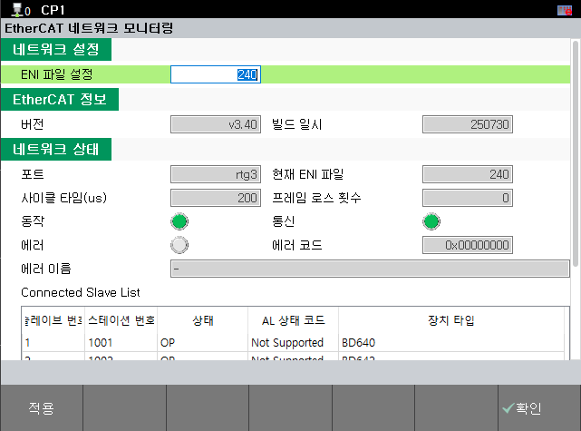
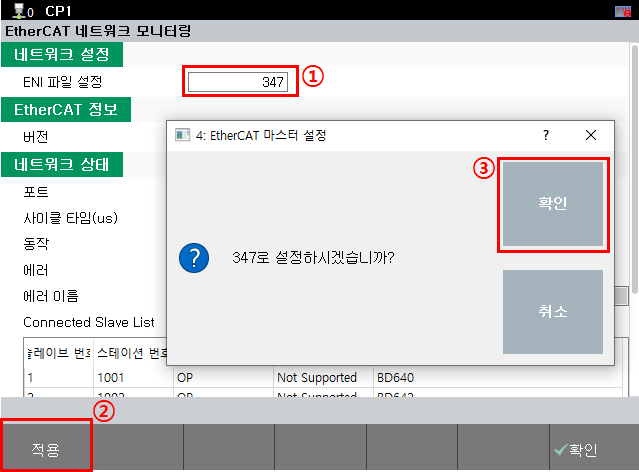
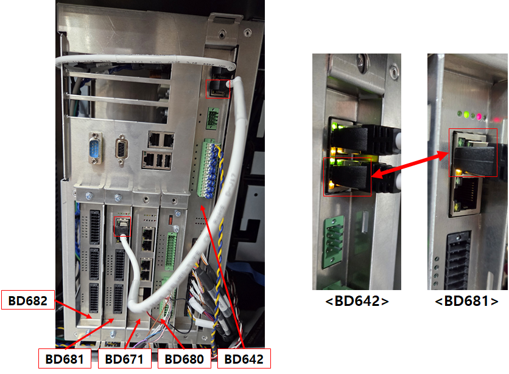
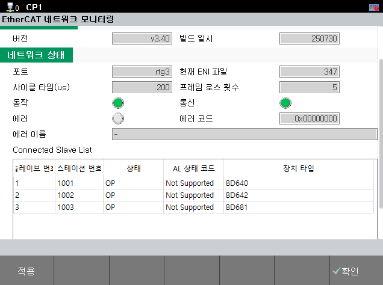
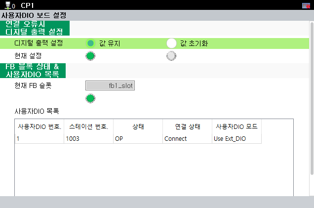
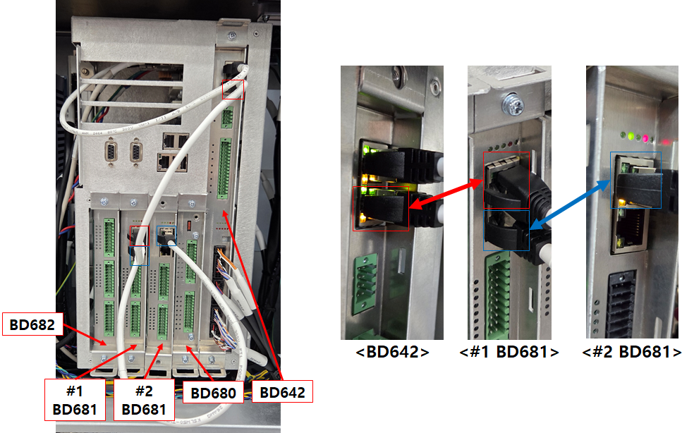
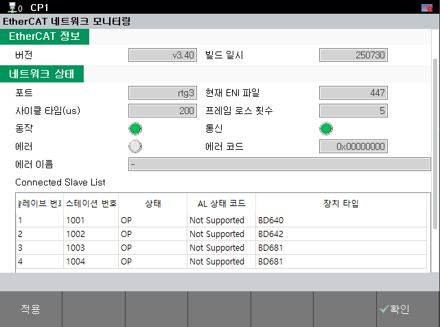
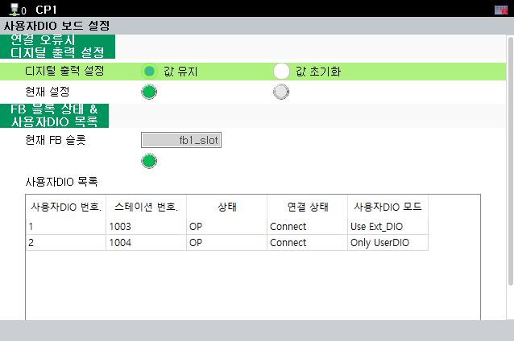

# 5.5.3.2 EtherCAT 설정

EtherCAT 설정은 다음과 같이 진행합니다.
1. TP 메뉴에서 EtherCAT 구성 변경 
2. EtherCAT 케이블 연결 후 정상 연결 확인 

 <mark style="color:green;">**1. TP 메뉴에서 EtherCAT 구성 변경**</mark> 

'EtherCAT 네트워크 모니터링' 메뉴에 들어가서 변경할 수 있습니다.

- 메뉴 위치: [서비스] - [안전 시스템 진단] - [EtherCAT 네트워크 모니터링]

 
그림 5.9 EtherCAT 네트워크 모니터링 TP UI

'현재 ENI 파일' 에 나오는 숫자가 아래 표의 번호인지 확인합니다.

 

**표 5-11 사용자DIO EtherCAT 연결 ENI 번호**

<table>
<thead>
    <tr>
        <th style="width: 20px; text-align: center;">
            No.
        </th>
        <th style="width: 110px; text-align: center;">
            ENI 번호
        </th>
        <th style="width: 250px; text-align: center;">
            비고
        </th>
    </tr>
</thead>
<tbody>
    <tr>
        <td style="text-align: center;">
            <strong>1</strong>
        </td>
        <td style="text-align: center;">
            347
        </td>
        <td> 
             - 16채널 DIO (BD681)  
             - 32채널 DIO (BD681 + BD682)
        </td>
    </tr>
    <tr>
        <td style="text-align: center;">
            <strong>2</strong>
        </td>
        <td style="text-align: center;">
            447
        </td>
        <td> 
            - 48채널 DIO (BD681 + BD682 + BD681)
        </td>
    </tr>
</tbody>
</table>

다른 번호일 경우, 사용하는 환경 구성에 맞게 위의 표를 참고하여 변경해야 합니다.  
설정을 변경하기 위해서 'ENI 파일 설정' 에 변경할 ENI 번호를 입력하고 적용 버튼을 누른 후, 팝업창의 '확인' 을 누릅니다.
그리고 제어기의 전원을 **OFF** 합니다.

 
그림 5.10 EtherCAT ENI 설정 변경

 <mark style="color:green;">**2. EtherCAT 케이블 연결 후 정상 연결 확인**</mark> 

위의 1번 설정을 완료하고 제어기를 **OFF** 한 상태에서 LAN 케이블을 올바르게 연결해야 합니다.

**- BD681 1개 구성 (BD681 또는 BD681 + BD682), (ENI 347)**

 
그림 5.11 BD681 1개 케이블 연결

위의 그림과 같이 BD642의 아래쪽 랜커넥터와 BD681 위쪽 랜커넥터를 연결한 후 제어기 전원을 **ON** 합니다. 정상적으로 EtherCAT이 연결되면 아래와 같이 TP에서 확인 가능합니다.

 
그림 5.12 BD681 1개 EtherCAT 네트워크 모니터링  

 
그림 5.13 BD681 1개 사용자DIO 보드 설정 

 
그림 5.14 BD681 상태표시 LED 

BD681 보드의 상태표시 LED는 정상적으로 연결이 완료 될 경우, 다음과 같은 순서로 동작합니다.  

- BD681 보드 상태표시 LED 동작
1. 2초 점등 (EtherCAT 연결 대기중)
2. 0.25초 점등 (EtherCAT 연결 Ok, 초기 설정값 대기중)
3. 0.75초 점등 (EtherCAT 연결 Ok, 초기 설정 Ok)
  

**- BD681 2개 구성 (BD681 + BD682 + BD681), (ENI 447)**

 
그림 5.15 BD681 2개 케이블 연결

위의 그림과 같이 BD671 자리에 #2 BD681을 꽂아 넣습니다.


#2 BD681은 보드 스위치가 **ON** 되어야 합니다.  
세부 내용은 "[5.5.3.1 보드 스위치 확인](./1-Board-Switch-Setting.md)" 매뉴얼을 참고하시기 바랍니다.


BD642의 아래쪽 랜커넥터와 #1 BD681 위쪽 랜커넥터를 연결한 후, #1 BD681 아래쪽 랜커넥터와 #2 BD681 위쪽 랜커넥터를 연결합니다. 그리고 제어기 전원을 **ON** 합니다. 정상적으로 EtherCAT이 연결되면 아래와 같이 TP에서 확인 가능합니다.

 
그림 5.16 BD681 2개 EtherCAT 네트워크 모니터링  

 
그림 5.17 BD681 2개 사용자DIO 보드 설정 

BD681 보드의 상태표시 LED는 정상적으로 연결 될 경우, 'BD681 1개 구성'의 'BD681 보드 상태표시 LED 동작' 과 동일하게 동작합니다.