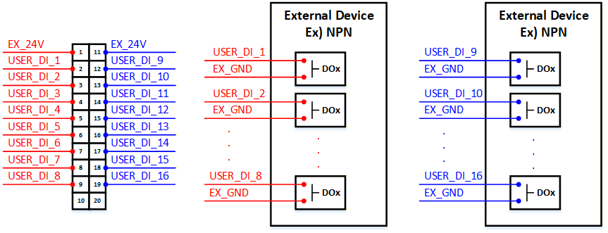
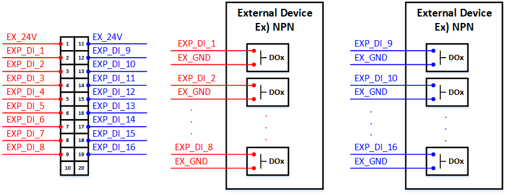
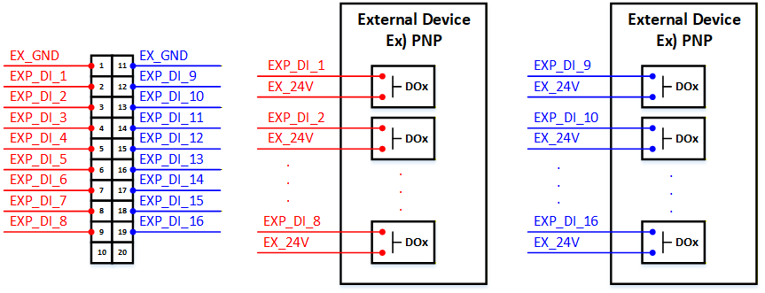
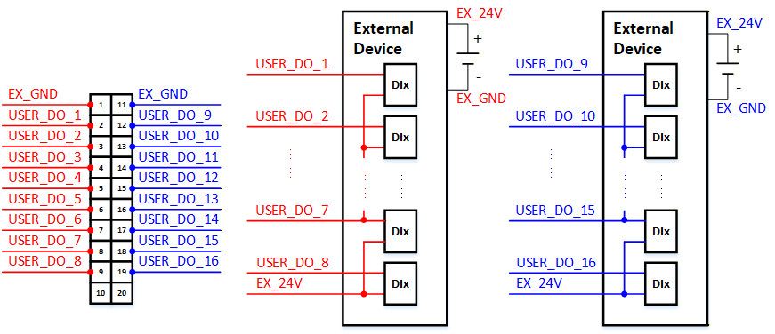
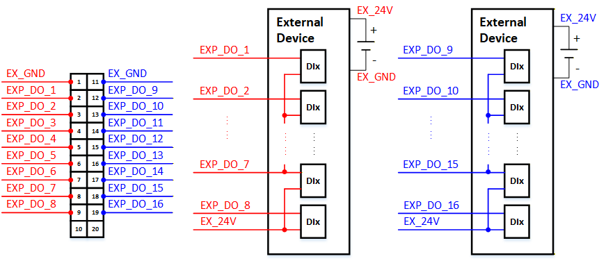
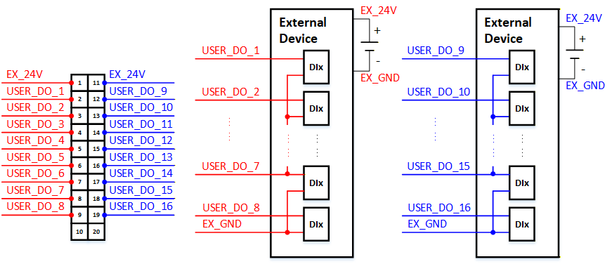
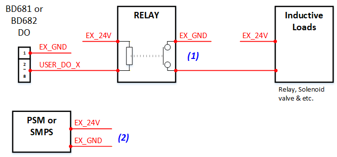
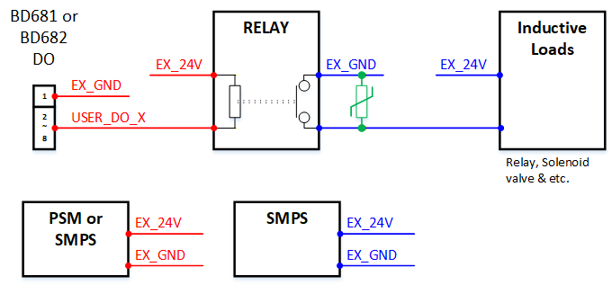

# 5.5.3 Use Guide

When wiring the digital inputs/outputs, always ensure that the controller power is turned OFF before performing any wiring work.


The User DIO module(BD681) and the expansion DIO module(BD682) can be connected to or configured with various external devices via digital IO ports.

(1) Digital Input/Output Specification 
The digital input specifications for User DIO module(BD681) and the expansion DIO module(BD682) are identical, as shown in the table below. 

<table style="border-collapse: collapse; width: 100%;">
  <caption style="text-align: left; padding-bottom: 0; margin-bottom: 0;">
Table 5.5.3-1 BD681 & BD682 Digital Input Specification
  </caption>
<thead>
  <tr>
    <th><strong>Items</strong></th>
    <th><strong>Specification</strong></th>
  </tr>
</thead>
<tbody>
  <tr>
    <td>Inputs per module</td>
    <td>2 x (8 Channels Universal Digital Type)</td>
  </tr>
  <tr>
    <td>Indicators</td>
    <td>16 Green Input State</td>
  </tr>
  <tr>
    <td>ON-state Voltage</td>
    <td>24.0Vdc Nominal, 15.8 ~ 28.3V</td>
  </tr>
  <tr>
    <td>OFF-state Voltage</td>
    <td>7.8Vdc Nominal</td>
  </tr>
  <tr>
    <td>ON-state Current</td>
    <td>4.8mA @24.0Vdc 
    5.6mA @28.3Vdc</td>
  </tr>
  <tr>
    <td>Nominal Input Impedance</td>
    <td>5.0 Kohm typical</td>
  </tr>
  <tr>
    <td>Common Type</td>
    <td>2 x (8 Channels / 2 COM)</td>
  </tr>
</tbody>
</table>

The digital output specifications for the user DIO module(BD681) is identical, as shown in the table below. 

Table 5.5.3-2 BD681 Digital Output Specification
<table>
<thead>
  <tr>
    <th><strong>Items</strong></th>
    <th><strong>Specification</strong></th>
  </tr>
</thead>
<tbody>
  <tr>
    <td>Outputs per module</td>
    <td>2 x (8 Channels) PNP/NPN Type</td>
  </tr>
  <tr>
    <td>Indicators</td>
    <td>16 Green Input State</td>
  </tr>
  <tr>
    <td>Output Voltage Range</td>
    <td>24.0Vdc Nominal, 15.8 ~ 28.3V</td>
  </tr>
  <tr>
    <td>Output Current Rating</td>
    <td>Max. 0.1A Per Channel</td>
  </tr>
  <tr>
    <td>Protection</td>
    <td>Over-Current Protection</td>
  </tr>
  <tr>
    <td>Common Type</td>
    <td>2 x (8 Channels / 2 COM)</td>
  </tr>
</tbody>
</table>

The digital output specifications for the expansion DIO module(BD682) is identical, as shown in the table below. 

Table 5.5.3-3 BD682 Digital Output Specification
<table>
<thead>
  <tr>
    <th><strong>Items</strong></th>
    <th><strong>Specification</strong></th>
  </tr>
</thead>
<tbody>
  <tr>
    <td>Outputs per module</td>
    <td>2 x (8 Channels) PNP/NPN Type</td>
  </tr>
  <tr>
    <td>Indicators</td>
    <td>16 Green Input State</td>
  </tr>
  <tr>
    <td>Output Voltage Range</td>
    <td>24.0Vdc Nominal, 15.8 ~ 28.3V</td>
  </tr>
  <tr>
    <td>Output Current Rating</td>
    <td>(1~8channel) Max. 0.1A Per Channel 
    (9~16channel) Max. 1.5A Per Channel</td>
  </tr>
  <tr>
    <td>Protection</td>
    <td>Over-Current Protection</td>
  </tr>
  <tr>
    <td>Common Type</td>
    <td>2 x (8 Channels / 2 COM)</td>
  </tr>
</tbody>
</table>

(2) Wiring digital inputs 
* NPN-TYPE(:Active Low) 
In the figure below, red indicates channels 1 to 8, and blue indicates channels 9 to 16. When using an external power supply or PSM power, connect to (+)EX_24V and (-)EX_GND. 
For the NPN-type, connect the external power (+)EX_24V to pins 1 and 11 of the BD681 and BD682, and connect (-)EX_GND to the external device. 
Refer to the wiring example below for connecting external devices. 

 
Figure 5.5.3-1 BD681 Digital Input Wiring Diagram for NPN-Type 

 
Figure 5.5.3-2 BD682 Digital Input Wiring Diagram for NPN-Type 

* PNP-TYPE(:Active High) 
In the figure below, red indicates channels 1 to 8, and blue indicates channels 9 to 16. When using an external power supply or PSM power, connect to (+)EX_24V and (-)EX_GND. 
For the PNP-type, connect the external power (-)EX_GND to pins 1 and 11 of the BD681 and BD682, and connect (+)EX_24V to the external device. 
Refer to the wiring example below for connecting external devices. 

 
Figure 5.5.3-3 BD681 Digital Input Wiring Diagram for PNP-Type 

 
Figure 5.5.3-4 BD682 Digital Input Wiring Diagram for PNP-Type 

(3) Wiring digital outputs 
* NPN-TYPE(:Active Low) 
In the figure below, red indicates channels 1 to 8, and blue indicates channels 9 to 16. When using an external power supply or PSM power, connect to (+)EX_24V and (-)EX_GND. 
For the NPN-type, connect the external power (-)EX_GND to pins 1 and 11 of the BD681 and BD682, and connect (+)EX_24V to the external device. 
Refer to the wiring example below for connecting external devices. 

 
Figure 5.5.3-5 BD681 Digital Output Wiring Diagram for NPN-Type 

 
Figure 5.5.3-6 BD682 Digital Output Wiring Diagram for NPN-Type 

* PNP-TYPE(:Active High) 
In the figure below, red indicates channels 1 to 8, and blue indicates channels 9 to 16. When using an external power supply or PSM power, connect to (+)EX_24V and (-)EX_GND. 
For the PNP-type, connect the external power (+)EX_24V to pins 1 and 11 of the BD681 and BD682, and connect (-)EX_GND to the external device. 
Refer to the wiring example below for connecting external devices. 

 
Figure 5.5.3-7 BD681 Digital Output Wiring Diagram for PNP-Type 

 
Figure 5.5.3-8 BD682 Digital Output Wiring Diagram for PNP-Type 

(4) Precautions for Digital input/output Wiring 
* Case 1 
When digital output terminals are used for two or more stages of control depending on capacity, application or intended purpose (see the figure below). 

 
Figure 5.5.3-9 BD681 & BD682 Digital Output Case 1 

When wired as shown above, turning OFF an inductive load inevitably generates a reverse voltage(back EMF). Since there is no circuit configured to suppress it, this reverse voltage can flow back into the BD681 or BD682, potentially causing errors or malfunctions in the Hi7 controller. 

To prevent this issue, please implement one of the following solutions: 
Item (1): Install a varistor and diode to suppress the reverse voltage. 
Item (2): Design and provide a separate SMPS. 

 
Figure 5.5.3-10 BD681 & BD682 Digital Output: Solution for Case 1 

