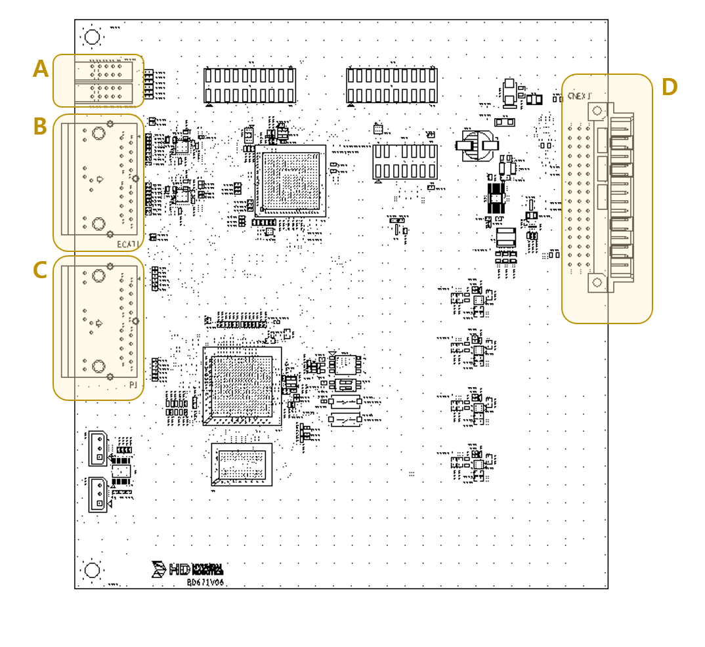

# 5.6.2. 커넥터

아래 그림은 옵션 안전 통신 보드(BD671)의 외부연결에 필요한 커넥터의 위치를 보여줍니다. 또한, 아래 표는 각 커넥터의 명칭, 용도를 기술합니다.

   
그림 6.2-1 안전 통신 보드(BD671) 커넥터 배치

표 6.2-1 안전 통신 보드(BD671) 커넥터 명칭, 용도
<table>
<tbody>
  <tr>
    <td><strong>번호</strong></td>
    <td><strong>명칭</strong></td>
    <td><strong>용도</strong></td>

  </tr>
  <tr>
    <td>A</td>
    <td>Status LED</td>
    <td>EtherCAT, PROFIsafe 통신 Status LED </td>
    
  </tr>
  <tr>
    <td>B</td>
    <td>EtherCAT RJ45 커넥터 IN/OUT </td>
    <td>내부 EtherCAT 통신용 커넥터</td>
    
  </tr>
  <tr>
    <td>C</td>
    <td>PROFIsafe RJ45 커넥터 </td>     
    <td>외부 유저 PROFIsafe 통신용 </td>
    
  </tr>
    <tr>
    <td>D</td>
    <td>백플레인 연결 커넥터 </td>     
    <td>BD642(Safety) 보드와 통신 및 전원 공급 </td>
    
  </tr>
</tbody>
</table>

표 6.2-2 A 파트의 Status LED 명칭, 용도
<table>
<tbody>
  <tr>
    <td><strong>명칭</strong></td>
    <td><strong>M1 Status</strong></td>
    <td><strong>Diagnosis LED</strong></td>
    <td><strong>Maintenance LED</strong></td>
    <td><strong>미삽</strong></td>
    <td><strong>EtherCAT 진단 LED</strong></td>
    
  </tr>
  <tr>
    <td>LEDS1</td>
    <td>GREEN (RUN)</td>
    <td>ORANGE </td>
    <td>YELLOW </td>
    <td>- </td>
    <td>GREEN (RUN) </td>
    
  </tr>
  <tr>
    <td>LEDS2</td>
    <td>RED (ERROR)</td>
    <td>-</td>
    <td>- </td>
    <td>- </td>
    <td>RED(ERROR) </td>
    
  </tr>

</tbody>
</table>
